**Version:** 1.9 (single self-contained document: the full PDDL `FALLBACK` specification is now inlined as **§17**, translated to English, and the standalone `pddl-fallback-design.md` is removed)
**Previously:** 1.8 (design-review fixes: PDDL `FALLBACK` folded in as the 6th kind with a unified `U_mission` and one shared push-aware cost estimator — §4.4, §5.5; `deadline`/`EXPIRED` added to the Mission schema/state machine — §4.2–4.3; sync-gate liveness & gate scoping — §8.5; `P_FEASIBLE_MIN` floor defined — §5.5/§12; `DECAY_INTERVAL_TICKS` unit collision closed throughout — §5); 1.7 (deadline urgency in `U_mission`, §5.5); 1.6 (execution selector §9.9, mission/contract lock precedence §9.10); 1.5 (BDI-only team orchestration — `U_team`, marginal-route SSI auction, rebalance, partner/enemy split); 1.4 (open-loop platform assumption, offline calibration §16)
**Builds on:** the single-agent utility-based BDI core (formerly `specs-draft.md`, removed from this repo; §5 restates everything this design relies on)
**Scope:** two cooperating BDI agents + a natural-language special-mission system driven by an LLM

---

## 1. Design goals

Two agents must play Deliveroo.js together to maximise the **combined** score, while one of them additionally receives **special missions** as natural-language messages from the server. Missions are open-ended (the three tiers in the brief are only examples), so the system must absorb arbitrary instructions without hard-coding each one.

Three principles drive the whole design:

1. **The single-agent BDI core is untouched.** Everything new rides on top as injected intentions, utility hooks, and shared state. If the mission machinery is idle or broken, both agents still play correct base strategy.
2. **The LLM never sits in the 50 ms loop.** It is an asynchronous *compiler* from text to a typed `Mission` object. Game latency is never gated on an LLM call.
3. **Everything is scored in one currency — reward points.** Missions, tolls, decay, and base delivery all reduce to the same utility units, so the existing utility selector resolves every trade-off with no bespoke "conflict resolver".

> **Platform assumption — no reward feedback (open-loop execution).** The server never confirms whether a mission actually paid out: there is no signal that distinguishes a collected `+10` from a missed one, and no per-mission reward channel the agent can read back. Missions therefore execute **open-loop** — the agent compiles a message, acts on it, and *trusts* that the stated payoff materialises; it cannot detect or recover from a misread after the fact. Two consequences run through the rest of the design. **(a)** Because there is no recovery downstream, the conservative compilation rules are not optional polish but the *only* safeguard: the worst-case bias on ambiguous sign/hardness (§7.3) and the `P_feasible` map-validation gate (§3.1) are as load-bearing as the irreversibility guards on crate pushes (§15). A wrong "pursue" is silent and permanent. **(b)** Hyperparameter calibration cannot be online *for mission-related tunables* — with no observed mission reward there is nothing to learn from at runtime — so every **mission-related** tunable (§5.8) must be fixed **offline**, in simulation, before deployment (§16). The one observable exception is the agent's **own realised-delivery rate**: `ū_forgone` (§7.1) and `ρ_ref` (§5.5 clamp) are runtime running averages of *own* deliveries, which the agent *can* see (own pickups/putDowns are ground truth) — open-loop only blacks out *mission* payoffs, not the team's base throughput.

---

## 2. Architecture overview

Two peer agents share a **blackboard** and each run the identical single-agent loop. The only asymmetry: the **Liaison** holds the channel to server mission messages and an async LLM lane; the **Courier** does not.

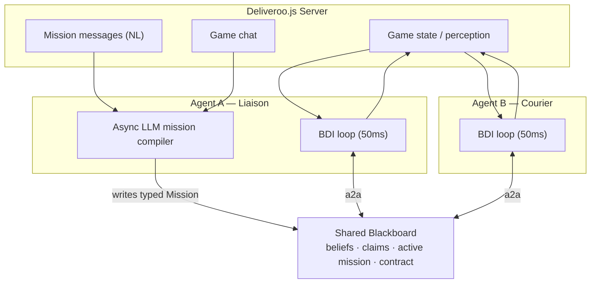

### 2.1 Agent roles

| Aspect | Liaison (Agent A) | Courier (Agent B) |
|--------|-------------------|-------------------|
| Base play | full BDI, identical | full BDI, identical |
| Server mission channel | **yes** | no |
| Game-chat read/write | **yes** | no |
| LLM compiler lane | **yes** | no |
| Reads blackboard (beliefs, claims, mission, contract) | yes | yes |
| Accepts injected mission intentions | yes | yes |

The Courier is **not** a slave: during normal play it bids and acts autonomously. The Liaison only *proposes* contracts; it never micromanages the Courier's base behaviour. If the Liaison dies, the Courier keeps playing — it simply can no longer compile new missions.

### 2.2 The blackboard

The blackboard is the shared, replicated state both agents read and write over the agent-to-agent (a2a) channel.

| Field | Contents |
|-------|----------|
| `beliefs.parcels` | union of both agents' perceived parcels (id, pos, `rewardSeen`, carriedBy, lastSeen) — full schema §2.3 |
| `beliefs.agents` | union of perceived agents (self, partner, enemies) with last-seen ticks — §2.3 |
| `beliefs.crates` | union of known crate positions (`KNOWN`/`UNKNOWN`), permanent dynamic entities — §2.3 |
| `claims` | `claim{parcelId, agentId, tick, origin}` — `origin = AUCTION` (soft, expiring reservations) or `MISSION` (hard locks owned by the active mission/contract, §9.10) |
| `mission` | the **single** active `Mission` (or none) |
| `contract` | the open coordination `Contract` (or none) |
| `gate` | shared movement flag for sync-gate missions (default: open); its freshness check is armed **only while a `SYNC_GATE` contract is `ACTIVE`** (§8.5) |
| `config` | server-sent constants: map, decay interval, observation distance (carry capacity is unlimited — `game-rules.md`) |

> The static tile *type* map is known a priori (server config). Three kinds of dynamic entity flow through perception and shared memory — parcels, agents, and crate positions. The full belief model (schema, per-tick update, replication, and what is stored versus derived) is **§2.3**.

### 2.3 The common belief base

Both agents act on **beliefs**: a necessarily partial, possibly stale model of the world. In this design the belief base is **shared** — each agent writes what it perceives and both read the union — because a shared memory lets an agent value a parcel it can no longer see and steer exploration toward stale regions (§5.1).

Two principles run through everything below.

- **Stored beliefs are facts-as-last-observed, never projections.** The base stores *what* was observed and *when* (a `lastSeen` tick). Anything extrapolated to "now" — decayed reward, survival probability, who wins a race — is **derived on read** (§2.3.2), never written back as if observed. This is the same discipline the crate layer uses: act on live state, never on a cached projection (§15.2).
- **Shared facts, private derivations.** The stored base is identical for both agents, but the quantities each agent actually consumes are *not*: `P_avail(p)` and `d(\text{self},p)` depend on the reader's own position, so Liaison and Courier compute different utilities from the same facts. That is correct and intended — one shared world, two vantage points.

> **Platform assumption (this design).** The a2a channel is **local and reliable**: no loss, no reordering, negligible latency. This single assumption removes the need for any conflict-resolution, tombstone, or reconciliation machinery — see §2.3.5.

#### 2.3.1 Stored schema

Only observations are stored. Each record carries the tick it encodes (`lastSeen`).

**Parcel.**

```
ParcelBelief {
  id          : ParcelId
  pos         : Tile          // last observed position
  rewardSeen  : number        // reward AT lastSeen — frozen, NOT decayed to now
  carriedBy   : AgentId | null// null ⇒ on the ground and pickable
  lastSeen    : tick
}
```

`rewardSeen` is frozen at observation; the value-now `R_now` is derived (§5.2, §2.3.2). A parcel carried by *self* keeps a normal record with `carriedBy = self.id` — it is not duplicated into a separate list (see **self** below). A parcel with `carriedBy ≠ null` is not a ground candidate (`pickUp` collects only uncarried parcels, `game-rules.md`); carried parcels still decay, so their value must keep being tracked for delivery decisions.

**Agent.**

```
AgentBelief {
  id          : AgentId
  pos         : Tile          // last observed position
  rel         : SELF | PARTNER | ENEMY   // a priori, from team config
  lastSeen    : tick
  carrying?   : [ParcelId]    // partner only, from its self-broadcast
}
```

**Crate.** Crates (type-5 tiles) are pushable, so their *positions* are dynamic and uncertain, but unlike parcels a crate never disappears and never moves on its own — only an agent pushing it moves it, by exactly one tile onto an adjacent type-5 tile (`game-rules.md`). A crate is therefore a **permanent** entity with a sticky position.

```
CrateBelief {
  id          : CrateId
  state       : KNOWN | UNKNOWN
  pos         : Tile          // when KNOWN
  candidates  : [Tile]        // when UNKNOWN: adjacent type-5 tiles it may occupy
  locked      : bool          // "5!" — initially locked
  lastSeen    : tick
}
```

Initial crate positions come from the map config (`KNOWN` at startup); thereafter they update only by perception.

**Self / config.** `beliefs.self` is each agent's own ground truth — `id`, `pos`, `carrying` (the derived set `{p : carriedBy == self.id}`), `score`. It is authoritative for its owner and published to the partner as an `AgentBelief` with `rel = PARTNER`. `config` holds the static constants (map, `deliveryZones`, `spawners`, `obsDistance`, `decayInterval`, `movementDur`, reward params) computed once at startup and never merged.

#### 2.3.2 Stored vs. derived — the rule

> If a quantity changes when the tick advances **with no new observation**, it is **derived** and is computed on read. If it changes only when the world is **observed**, it is **stored**.

`rewardSeen` is stored (changes only on observation); `R_now`, `age`, `P_surv`, `P_avail`, `raceDiscount`, and all `d(·,·)` path lengths are derived from stored fields plus `t_now` and the reader's position (§5.2–5.3). Storing them would be a bug: they go stale the instant the tick advances.

#### 2.3.3 Per-tick update

Each tick an agent perceives every entity within `obsDistance` and folds it into the base:

- **Perceived entity** → upsert its record with `lastSeen = t_now`.
- **Parcel in range but not perceived** → it is gone from the world (picked up or expired-and-cleared); **delete** the record. (Absence of evidence is only asserted for tiles currently in view; an out-of-range parcel keeps its old record so shared memory can still value it.)
- **Crate observed to have left its `KNOWN` tile, new tile not visible** → set `state = UNKNOWN` with `candidates` = the adjacent type-5 tiles it could have been pushed onto (often one or two; fully disambiguated if the pushing agent and direction were also seen). The vacated tile is positively known free.
- **Own actions** update beliefs directly, not via perception: on `pickUp` the parcel's `carriedBy` becomes self; on a delivery `putDown` the parcel is deleted (removed from the game); on a non-delivery drop `carriedBy → null` at the current tile.

Parcel records are **evicted** once `age > STALE_TTL` — by then `P_surv` (which halves every ~3 decay intervals, §5.3) has decayed to near-nothing, so the candidate is worthless. At the default `STALE_TTL` of **9 decay intervals** that is three halvings, `P_surv ≈ 0.125`; eviction is not safety-critical (the worthless record would lose the argmax anyway), it only bounds memory, so the exact cut-off is not load-bearing. `STALE_TTL` is a tunable (default 9 decay intervals). **Agents and crates are never evicted**: a stale enemy position simply earns a low freshness weight (§5.3), and a crate is permanent.

#### 2.3.4 Crates: optimistic planning, runtime-checked safety

An `UNKNOWN` crate could block a tile the planner believes free. The resolution is **optimistic**: A\* plans over the `candidates` as if free, because correctness does not depend on the plan being right — the admissibility invariant re-checks **live perceived state at the tick a push is executed**, and the executed push is always adjacent to the agent, hence inside the perception radius (§15.1–15.2). A stale crate belief can therefore cost only path optimality (approach, perceive the truth, replan), never an unsafe or irreversible push. Re-observation by either agent restores the true position. No enemy-proximity "suspect" heuristic is used — the runtime invariant already covers correctness.

#### 2.3.5 Replication & synchronization

Each agent holds a **complete local replica** of the belief base — not a single central store owned by one agent. The reason is resilience: if the Liaison dies, a central store would take the shared memory with it, but the design requires the Courier to keep full base play (§11). Full replication makes each agent self-sufficient.

Synchronization, under the local-reliable channel assumption, reduces to a broadcast with **no conflict resolution**:

1. an agent ingests its own perception into its replica;
2. on a **material change** it broadcasts a **delta** — observed parcels, observed agents, observed crate updates, deleted entities, and its own `self` — to the partner;
3. the partner applies the delta into its replica.

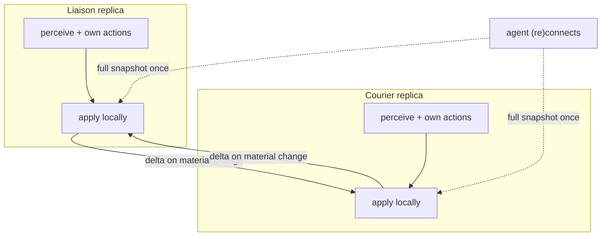

- **Material change** = a parcel appears / is taken / changes `carriedBy` / is picked or delivered; an agent (enemy or partner) is seen at a new tile, first seen, or gone from view; a crate update; or own movement. In practice the broadcast fires almost every active tick (enemies and self move constantly) and falls silent only when an agent is **stationary with nothing in view** — e.g. waiting at a barrier. That silence is the only saving, and it is free.
- **No conflict resolution needed.** Two agents seeing the same entity on the same tick read identical game state, so they write identical data. Observations at different ticks resolve by higher `lastSeen`. With reliable, ordered, zero-latency delivery there is no scenario where a stale record arrives after a fresher one, so no tombstones, CRDT, digests, locks, or acknowledgements are required.
- **Cold start / reconnect.** Because deltas only carry *changes*, an agent that starts (or restarts after a crash) begins empty. On (re)connection the already-active agent sends a **one-time full snapshot**; the stream then continues as deltas.

#### 2.3.6 Requirements coverage

| Req | Where |
|-----|-------|
| R8 (a2a with graceful degradation) | §2.3.5 (full replica; lost partner ⇒ each runs on own perception) |
| R9 (adversarial enemies) | §2.3.1 (`rel=ENEMY`), §5.3 (freshness-weighted race discount) |
| R20 (shared sensing memory) | §2.3 (shared replicated base) |
| R21 (memory aids exploration) | §2.3.3 (out-of-range parcels retained), §5.5 (`staleness`) |
| R22 (exponential memory decay) | §2.3.3 eviction, §5.3 (`P_surv`, agent `freshness`) |

---

## 3. The mission compiler (LLM lane)

The LLM's entire job: read one message, emit one typed object. It has **no map and no positions**, so it never invents or locates anything spatial.

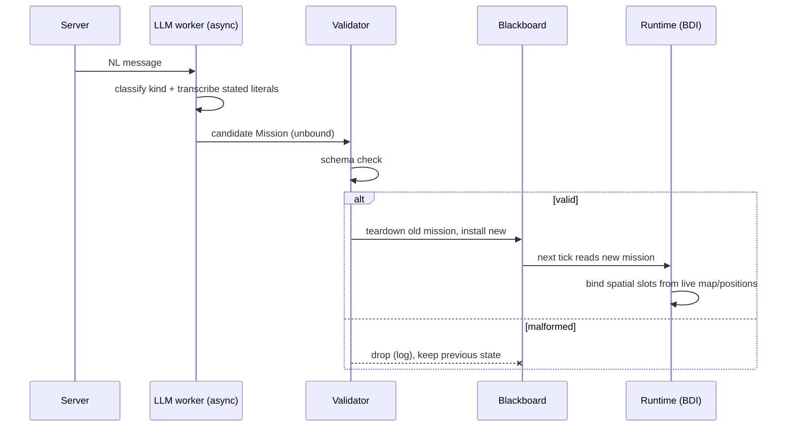

### 3.1 Transcribe vs. runtime-bind — the hard rule

A coordinate enters a mission **only** in one of two ways:

- **Transcription (LLM):** the value is written in the message. *"Move to (4,7)"* → the LLM copies the literal `(4,7)`. It is copying tokens, not reasoning about space. Stated formulas (*"x=4\*2, y=(1+3)\*3"*) are evaluated — ideally by a calculator tool, not LLM arithmetic.
- **Localization (runtime):** the value must be chosen from the map (a handoff drop tile, a meeting point). The LLM cannot produce it; the runtime binds it from live beliefs.

Every transcribed value is still **validated** against the real map. If *"(4,7)"* is a wall or unreachable, the runtime sets `P_feasible = 0` and the agent ignores the mission. The LLM copies the number; the runtime decides whether it is real.

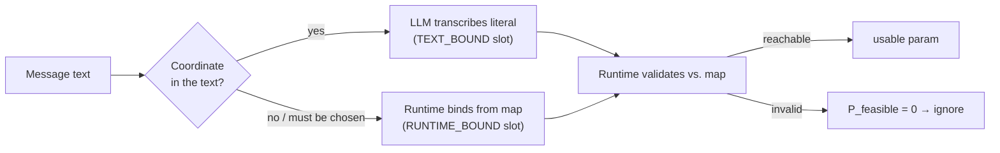

---

## 4. Mission taxonomy

A message compiles into exactly one of **six** kinds — the first five are the typed *fast path*; `FALLBACK` is the catch-all routed to the PDDL planning lane (§4.4).

| Kind | Meaning | Plugs into | Example message |
|------|---------|-----------|-----------------|
| `QUERY` | stateless answer, no game effect | replies in channel | "What is the capital of Italy?" / "Calculate 5×5" |
| `CANDIDATE_INTENTION` | soft, optional goal competing in the utility selector | intention set | "Move to (4,7) and get +10" |
| `REWARD_SHAPER` | reshapes delivery valuation via `m(k)`/`g(tile)` | `deliverBundle` + `U_collect` hold/collect | "Deliver stacks of exactly 3 to double the reward" |
| `HARD_CONSTRAINT` | priced toll or absolute value filter | A\* edge cost / `value(S)` filter | "Do not go through (x,y) or lose 50" / "Deliver parcels >10 → no reward" |
| `COORDINATION_CONTRACT` | joint goal for both agents | generic `Contract` | "Parcel picked by one agent and delivered by the other → +200" |
| `FALLBACK` | none of the 5 fits → unseen mission structure | async PDDL planning lane (§4.4) | "Visit every tile of the left room while staying 3 away from any enemy" |

### 4.1 Worked classification examples

| Message | Kind | Compiled object (LLM output) |
|---------|------|------------------------------|
| "Move to (4,7) and you get +10" | `CANDIDATE_INTENTION` | `{kind, payoff:+10, params:{targetTile:(4,7) /*TEXT_BOUND*/}}` |
| "Drop a package in the leftmost tile to get -10" | `CANDIDATE_INTENTION` | `{kind, payoff:-10, params:{rule:"leftmost delivery"}}` → negative EV, never selected |
| "What is the capital of Italy?" | `QUERY` | `{kind:QUERY, answer:"Rome"}` (slot untouched) |
| "Deliver stacks of exactly 5 → 0.3× reward" | `REWARD_SHAPER` | `{kind, m:{5:0.3}}` |
| "Deliver in (x1,y1) or (x2,y2) → 5× reward" | `REWARD_SHAPER` | `{kind, g:{(x1,y1):5,(x2,y2):5}}` → value-aware zone routing |
| "Deliver in (x1,y1) → 0 pts" | `REWARD_SHAPER` | `{kind, g:{(x1,y1):0}}` → zone avoided |
| "Do not go through tile (3,3) otherwise -50" | `HARD_CONSTRAINT` | `{kind, sub:PRICED, params:{tile:(3,3)}, payoff:-50}` |
| "If you deliver parcels with score >10 you get no reward" | `HARD_CONSTRAINT` | `{kind, sub:ABSOLUTE, params:{filter:"any reward>10 ⇒ value 0"}}` |
| "Picked by one agent, delivered by the other → +200" | `COORDINATION_CONTRACT` | `{kind, type:HANDOFF, payoff:+200, condition:"cross-agent delivery"}` |

> Note the trap pair: *"+10"* vs *"-10"* differ **only** in the payoff sign. The LLM must transcribe the sign correctly; the signed-EV selector then naturally pursues positive missions and ignores negative ones. When sign or hardness is ambiguous, bias toward treating it as a constraint to **avoid** — avoiding is cheap, a wrong "pursue" is expensive.

### 4.2 Mission schema

```
Mission {
  id          : string
  rawText     : string                       // original message, for logging
  kind        : QUERY | CANDIDATE_INTENTION | REWARD_SHAPER
              | HARD_CONSTRAINT | COORDINATION_CONTRACT | FALLBACK
  sub         : PRICED | ABSOLUTE            // hard-constraint flavor only
  payoff      : number                       // SIGNED reward; drives pursue/avoid
  theta?      : number                       // per-mission weight override (LLM); else θ_mission default
  priority?   : number                       // LLM-stated priority hint (advisory)
  abstractIntent : string                    // LLM always emits it — the FALLBACK grounding input (§4.4)
  fallbackJustification? : string            // REQUIRED iff kind = FALLBACK: why none of the 5 typed kinds fit
  plan?       : PddlPlan                      // FALLBACK only: the synthesised plan once PLAN_READY (§4.4)
  L?          : tick                          // FALLBACK only: planner-estimated ticks to completion (same estimator as d(·,·))
  deadline?   : tick                          // latest tick by which the mission must complete; drives s_m urgency (§5.5). Absent ⇒ no deadline (s_m = ∞)
  params      : { ... }                      // tiles (TEXT_BOUND | RUNTIME_BOUND),
                                             //   count→factor map m(k), filter, etc.
  assignment  : { mode: ANY_ONE | ALL | PREDICATE, count?, predicate? }
  selfCheck   : (beliefs) => bool            // never-true ⇒ effectively persistent
  installed   : [handle]                     // effects to tear down on replace
  status      : PENDING | ACTIVE | SATISFIED | FAILED | EXPIRED | SUPERSEDED
              | PENDING_CLASSIFY | CLASSIFIED | PENDING_PLAN | PLAN_READY
              | PLAN_FAIL | NOT_APPLICABLE   // the PDDL planning sub-states refine PENDING for kind = FALLBACK (§4.4)
}
```

There is **no `lifetime` field**: a mission is "persistent" exactly when its `selfCheck` can never return true (and it carries no `deadline`). One source of truth.

> **`deadline` (R-deadline).** A mission may carry an explicit `deadline` — a transcribed literal for a typed mission (*"…within 30 ticks"*) or, for a `COORDINATION_CONTRACT`, the contract's own `deadline` (§8.1). It feeds the slack term `s_m = deadline − t_now − L_m` in `U_mission` (§5.5); when absent, `s_m = ∞` and the urgency term vanishes (the mission reduces to the plain rate). A passed deadline (`s_m < 0`) drives the `Active → Expired` transition (§4.3).

> **The six kinds and the planning sub-states.** The first five kinds are the typed *fast path*; `FALLBACK` is the sixth, routed to the asynchronous PDDL planning lane (§4.4; full spec §17). The extra `status` values (`PENDING_CLASSIFY … NOT_APPLICABLE`) are **not** a second state machine — they are the internal refinement of `PENDING` that only a `FALLBACK` mission visits while it is being classified and planned; a typed mission goes straight `PENDING → ACTIVE` (§4.3).

### 4.3 Single slot, overwrite, teardown

Only **one** mission is active at a time. A new mission overwrites the slot, and overwriting must **tear down** the previous mission's installed effects (a shaper, a tile toll, an open contract, a held stack, **its `MISSION` parcel locks** — §9.10) or they leak. The parcel locks are installed effects like any other: an active mission claims its required parcels with `origin = MISSION` (superseding any `AUCTION` claim on them, MISSION > AUCTION), and teardown releases them back to the auction pool.

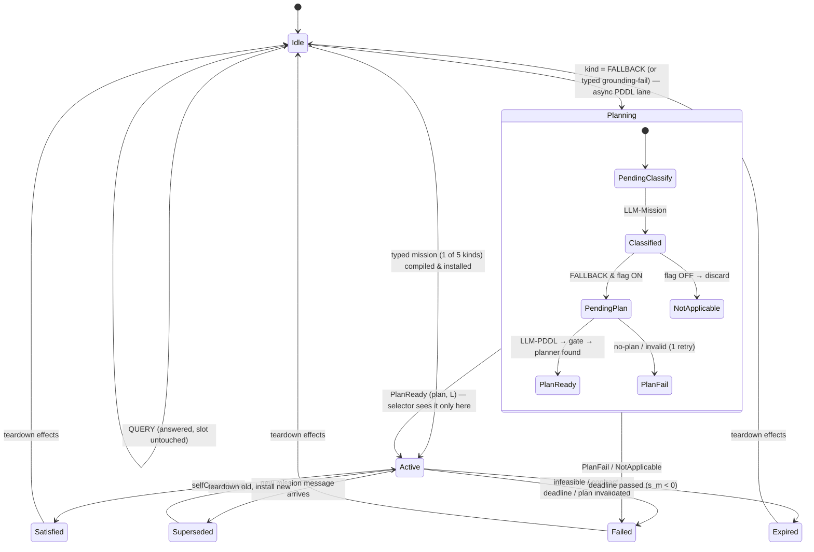

`QUERY` messages are answered in place and **do not** touch the slot — they are stateless, so a trivia question never wipes a running strategic mission. The `Planning` super-state is the §4.2 `PENDING_*` / `PLAN_*` refinement that **only a `FALLBACK` mission enters**; a typed mission takes the direct `Idle → Active` edge. `Active → Expired` fires when a `deadline`-bearing mission's slack goes negative (`s_m < 0`, §5.5), the give-up that keeps the agent off a lost cause; like `Satisfied`/`Failed` it tears down installed effects (including `MISSION` parcel locks, §9.10) and returns the slot to `Idle`.

> **Slot semantics — platform-confirmed (R14).** A new mission message overwrites/replaces the previous one, so a single slot with teardown is exactly right. Should that ever change to stacking missions, the slot generalises to **one slot per kind** — at most one shaper, one constraint, one contract, … — with the same per-slot teardown discipline; nothing downstream changes, since each kind installs into a different hook.

### 4.4 The `FALLBACK` kind — the PDDL planning lane

The five typed kinds cover every *anticipated* mission structure; a genuinely unseen one (a coverage goal, a constrained traversal, a multi-parcel ordering) compiles to `FALLBACK`. Rather than hard-code each, `FALLBACK` is routed to an **asynchronous PDDL planning lane** that synthesises a plan from a fixed, versioned domain. The full specification — atom catalogue, `InitBuilder`/`ValidationGate`/planner pipeline, plan lifecycle, and the open-world flag — is §17; this section (§4.4) states only the three contracts that bind it to the rest of the design.

1. **The planner sits *below* the selector, never beside it.** The PDDL lane is an asynchronous *compiler* exactly like the LLM mission compiler (§3): two LLM calls (semantic classification, then PDDL transcription against a validated atom vocabulary — never raw `:domain`/`:init`) produce a plan and its estimated length, off the 50 ms loop. The plan enters the per-tick argmax as the single candidate `U_mission` (§5.5, §9.9) — one decision point, no parallel resolver. While it compiles, both agents keep playing the installed mission or base strategy; a `FALLBACK` mission is invisible to the selector until it reaches `PLAN_READY` (§4.2 sub-states), equivalent to `P_feasible = 0` until then.

2. **One shared cost estimator (closes the cost-model asymmetry).** The plan length `L` and every `d(·,·)` the planner consumes come from the **same push-aware A\*** the rest of this design uses (§5.1, §15) — crates are treated as pushable, with **crates-as-walls only as the anytime fallback** when the push-aware search exceeds its budget. The PDDL `CostOracle` *is* that A\* (constraint-aware: tolls become edge costs, absolute constraints become graph masks; §7). It must **not** model crates as permanent hard walls, or the FALLBACK branch would score the same leg with a different `L` than a typed mission and skew the argmax. Same unit (ticks-to-goal), same estimator, both branches.

3. **One shared value scale (closes the `V_plan` asymmetry).** A FALLBACK plan that moves real parcels delivers value beyond its stated `payoff`; counting only `payoff` would understate it relative to base play. So the unified `U_mission` (§5.5) adds `V_plan` — the decayed value of parcels the plan itself delivers, via the **same kernel `V`** (§5.4) — to *every* mission's score, typed or fallback (it is simply `0` for missions that deliver no parcels, e.g. a pure coordinate intention or a query). Both branches are therefore scored on one scale.

**Execution is single-agent, assigned by the existing bid (R-coord).** PDDL plans egocentrically (`me`); it never plans for two bodies. The mission is assigned to **one** agent via the same role/claim bidding used for contracts (§9.3, §9.10): only the assignee plans and sees `PLAN_READY` in its argmax, and it `MISSION`-locks the parcels its plan references (§9.10) so the partner does not contest them. Multi-agent coordination stays in the utility layer (claims + shared beliefs), never inside the planner — consistent with §8 (typed contracts) and §17.8.

**The flag — conservative default for the unseen.** The lane has a single runtime switch. **OFF:** out-of-the-5 missions resolve to `NOT_APPLICABLE` and are discarded — pure utility core, the safe default when no sound model exists. **ON:** the lane is live under a static-world planning assumption (§17.7.4). The flag is runtime policy; the LLM knows nothing of it.

---

## 5. Unified utility — one currency

Every candidate the agent could pursue — collect a parcel, deliver, or fulfil a mission — is scored in **reward points per tick**, net of opportunity cost. A single rate-based selector then resolves every trade-off, so missions and base play compete with no bespoke conflict resolver.

Three facts anchor the whole model:

- **One move = one tick — by default config, not by law.** `movement_duration` (50 ms) happens to equal `CLOCK` (50 ms), so steps, ticks, and A\* path length coincide. Both are server-sent: derive ρ per *move* from server config at startup instead of hard-coding the identity. Everything below prices time in moves; with defaults that reads as **points per tick**.
- **One time unit everywhere — the tick.** All ages, distances, and slacks downstream are measured in **ticks**, so every time-derived constant must be expressed in ticks too. Define once, at startup, from server config:
$$
\text{DECAY\_INTERVAL\_TICKS} = \frac{\text{decaying\_event}}{\text{CLOCK}}
\qquad (\text{default } 1000\,\text{ms} / 50\,\text{ms} = 20\ \text{ticks})
$$
This is the single source of truth for both decay constants below (`ρ` in §5.2, `λ` in §5.3). The earlier spec used a bare `DECAY_INTERVAL` that silently meant *ms* in `ρ` and *ticks* in `λ` — a unit collision that made `λ` ~20× too small (a 3000-tick half-life instead of the intended 60). Pinning everything to `DECAY_INTERVAL_TICKS` removes the ambiguity.
- **Two decays, never conflated.** A parcel's *reward* shrinks deterministically (the game's own rule); its *existence* shrinks probabilistically (someone may grab it, or it expired and was cleared).
- **Opportunity cost is implicit in the rate.** Dividing expected points by the ticks they consume already penalises slow options; no separate "forgone utility" term is needed for single-agent intentions (contracts, which tie up both agents, still net the partner's forgone rate — §8.6).

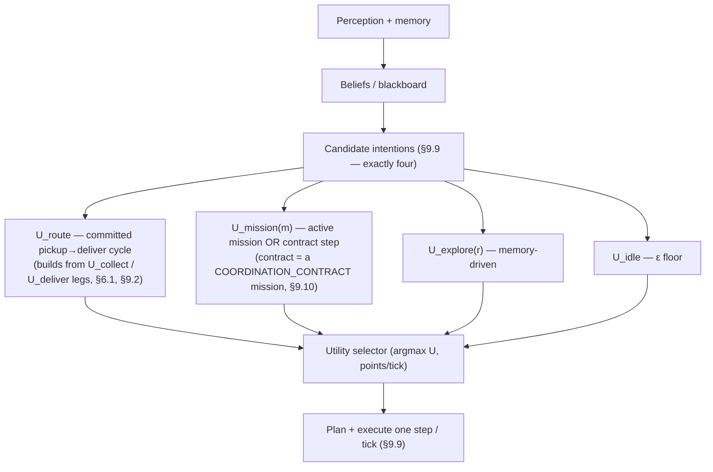

### 5.1 Shared sensing memory

Both agents write every perceived parcel and agent into the blackboard's `beliefs`, each stamped with the tick it was last seen (the belief base — schema, update, replication — is specified in **§2.3**). The memory has two jobs: it lets an agent value a parcel it can no longer see, and it **drives exploration toward stale regions** when nothing is in view. Its influence decays exponentially with staleness (§5.3), so an old sighting fades smoothly to zero rather than misleading the planner.

$$
t_\text{now} \quad \text{current tick}
$$
$$
t_\text{lastSeen}(p) \quad \text{tick } p \text{ was last directly perceived (0 age if in view now)}
$$
$$
\text{age}(p) = t_\text{now} - t_\text{lastSeen}(p)
$$
$$
d(a, b) \quad \text{A* path length } a \to b \text{ (real travel cost: walls, one-ways, crates)}
$$

**Crates in `d`.** One-ways are directed edges. A type-5 tile is walkable when crate-free; a crate-occupied tile is **blocked** unless a push through it is *admissible*. The path finder may move a crate by pushing it onto the type-5 tile beyond, but every push is gated by a single admissibility invariant and — crucially — that invariant is checked against **live state at the tick the push is actually executed**, never against a projection. Crate positions are dynamic state: any observed crate move invalidates cached `d(·,·)` through that region and forces a replan next tick. The full model (the invariant, why per-tick replanning makes path projection safe, and the optional coordination layer) lives in §15; the BDI core consumes only the resulting tick-length `L` and never reasons about crates.

### 5.2 Reward decay — deterministic (the game's rule)

The game removes 1 point every `DECAY_INTERVAL_TICKS` ticks, so per tick a parcel loses `ρ`. `Rnow` extrapolates a sighting to the present; `max(0,·)` because a parcel cannot be worth less than zero (it expires there).

$$
\rho = \frac{\text{MOVEMENT\_DURATION}/\text{CLOCK}}{\text{DECAY\_INTERVAL\_TICKS}}
\qquad \text{(points per move; } = 1/\text{DECAY\_INTERVAL\_TICKS when move = tick, i.e. } 1/20 = 0.05)
$$
$$
R_\text{now}(p) = \max\!\bigl(0,\; R_\text{last}(p) - \rho \cdot \text{age}(p)\bigr)
$$

(`MOVEMENT_DURATION/CLOCK` = ticks per move = 1 under default config, so `ρ = 1/DECAY_INTERVAL_TICKS`; both numerator and denominator are now ticks, so the unit is unambiguous.)

### 5.3 Existence decay + competitor race — probabilistic

`Psurv` is the chance the parcel is *still there at all*, driven by how stale the sighting is **and** how long we'd still travel to reach it (it can vanish en route). Exponential because each tick is an independent chance of disappearance — this is the memory's "exponential decay of importance".

$$
\lambda = \frac{\ln 2}{3 \cdot \text{DECAY\_INTERVAL\_TICKS}}
\qquad \text{(confidence halves every } {\sim}3 \text{ decay intervals)}
$$
$$
P_\text{surv}(p) = \exp\!\bigl(-\lambda \cdot (\text{age}(p) + d(\text{self}, p))\bigr)
$$

On top of survival, a **closer competitor (enemy) will probably grab it first**. This is the design's adversarial-awareness term — it discounts contested parcels rather than fighting for them. The product below ranges over **enemies only**; the partner is handled cooperatively, not as a threat (§9.4):

$$
\text{grab}(a, p) = \beta_\text{comp} \cdot \text{fresh}(a) \cdot \text{clamp}\!\left(\frac{d(\text{self},p) - d(a,p)}{d(\text{self},p)+1},\; 0,\; 1\right)
$$
$$
\text{fresh}(a) = \exp\!\bigl(-\lambda_\text{agent} \cdot \text{age}(a)\bigr)
\qquad \lambda_\text{agent} = \frac{\ln 2}{3}\ \text{(confidence halves every }{\sim}3\text{ ticks)}
$$
$$
\text{raceDiscount}(p) = \prod_{a}\bigl(1 - \text{grab}(a, p)\bigr)
\qquad \text{(independent threats multiply)}
$$
$$
P_\text{avail}(p) = P_\text{surv}(p) \cdot \text{raceDiscount}(p)
\qquad \text{(exists AND we win the race)}
$$

- `d(self,p) − d(a,p)` — how much closer competitor `a` is; positive $\Rightarrow$ a threat.
- `/(d(self,p)+1)` — normalise to a 0–1 race fraction; `+1` guards divide-by-zero when standing on the parcel.
- `clamp(…,0,1)` — if we're closer the term is $\leq 0$ $\Rightarrow$ no discount; capped at 1.
- `β_comp` — belief that a closer competitor actually takes it (0.7).
- **`fresh(a)` weights the threat by how recently the competitor was seen.** `d(a,p)` uses `a`'s *last observed* position (§2.3), so a long-unseen enemy has likely moved and should not keep discounting the parcel. `fresh(a)` decays the discount to 0 as the sighting ages — an enemy not seen for several ticks no longer cedes the parcel. We model only *position*, not intent: "closer ⇒ probably takes it" stays a heuristic that `β_comp` captures coarsely; we deliberately do not infer enemy targets (too costly for the 50 ms loop).
- **the partner is not a competitor here.** `raceDiscount` ranges over enemies only; a parcel claimed by the partner leaves candidacy outright with `P_avail = 0` (collaborator, not rival — §9.4). Cooperation flows through claims, competition through this discount, with no overlap.
- **no double counting:** λ is calibrated to expiry and *unobserved* disappearance only; pickup by a visible, closer competitor is priced exclusively by `raceDiscount`. Charging the same risk in both `P_surv` (via `age + d`) and `grab` would systematically over-discount contested parcels.
- **carried parcels are off the table:** a parcel last seen with `carriedBy` set to another agent gets `P_avail = 0` outright — `pickUp` collects only *uncarried* parcels (`game-rules.md`), so it is not a candidate until seen on the ground again.

### 5.4 The delivery value kernel

Everything downstream values a **set** `S` of parcels delivered to zone `z` after `L` more ticks of travel:

$$
V(S, z, L) = g(z) \cdot m(|S|) \cdot \sum_{i \in S} \max\!\bigl(0,\; R_\text{now}(i) - \rho \cdot L\bigr)
$$

- `Σ max(0, Rnow(i) − ρ·L)` — each parcel's reward, further decayed by the `L` ticks until arrival, floored at 0 independently.
- `m(|S|)` — the **count→factor** reward shaper (§6); default `1`.
- `g(z)` — the **location→factor** shaper (§6); default `1`. Also drives value-aware zone choice (§6.0).

With no shaper active $m \equiv g \equiv 1$, and $V$ reduces to "sum of travel-decayed rewards" — exact base behaviour.

### 5.5 Intention utilities — rate-based (points per tick)

All share the form **expected points $\div$ (ticks + 1)$^{\alpha}$**. The `+1` avoids divide-by-zero for a zero-distance action; $\alpha = 1.0$ makes it a pure rate.

$$
U_\text{deliver} = \frac{V(S^*, z^*, d(\text{self}, z^*))}{(d(\text{self}, z^*) + 1)^\alpha}
\qquad \text{($S^*, z^*$ from deliverBundle §6.1)}
$$

$$
L_p = d(\text{self}, p) + d(p, z^*)
$$

$$
U_\text{collect}(p) = \frac{P_\text{avail}(p) \cdot V(\text{carried} \cup \{p\},\; z^*,\; L_p)}{(L_p + 1)^\alpha}
\qquad \text{(subsumes "stack one more")}
$$

$$
U_\text{mission}(m) = \min\!\Bigl(\;
\theta_m \cdot P_\text{feasible}(m) \cdot \bigl(\text{payoff}(m) + V_\text{plan}(m)\bigr) \cdot
\max\!\left(\tfrac{1}{(L_m + 1)^\alpha},\; \tfrac{1}{(s_m + 1)^\alpha}\right),
\;\; c \cdot \rho_\text{ref} \;\Bigr)
$$

$$
s_m = \text{deadline}_\text{next}(m) - t_\text{now} - L_m
\qquad \text{(slack to the latest departure; $\text{deadline}_\text{next}$ = nearest binding deadline — §8)}
$$

One formula scores **every** mission, typed or `FALLBACK` (§4.4); the four terms each close a gap the old split left open. `θ_m` is the mission's own `theta` override (§4.2) or the global `θ_mission` default. `payoff(m) + V_plan(m)` is the **single value scale**: `payoff` is the message's stated reward (signed ⇒ negative missions never win), `V_plan(m)` is the decayed value of parcels the mission's own plan delivers, via the kernel `V` (§5.4) — `0` for missions that deliver no parcels (coordinate intentions, queries), so the term is harmless where it does not apply and prevents understating missions that move real cargo. `L_m` is the plan length from the **shared push-aware estimator** (§4.4, §15) — the same `d(·,·)` used everywhere, so typed and fallback missions are scored in the same unit. The `min(·, c·ρ_ref)` is the **rate ceiling**: in open-loop a hallucinated `payoff` shows up as an implausible points/tick, so the rate is capped at `c·ρ_ref` where `ρ_ref` is the 90th-percentile observed delivery rate shared on the blackboard (`c = 1.5` default; bootstrap and windowing in §17.6.3). It bites only when the rate is implausible, so a long legitimate mission is untouched.

$$
U_\text{explore}(r) = \frac{\theta_\text{explore} \cdot \bigl[\text{spawnValue}(r) + \kappa_\text{info} \cdot \text{staleness}(r)\bigr]}{(d(\text{self}, r) + 1)^\alpha}
$$

$$
U_\text{idle} = \varepsilon_\text{idle}
\qquad \text{(floor so any productive option dominates)}
$$

Why these shapes:

- **`U_collect` subsumes stacking.** `L_p` is the *full cycle* (go to the parcel, then carry it to the zone) — the earlier bug used only `d(self,p)` and undervalued the detour. Because `V` is evaluated on `carried ∪ {p}`, "should I grab one more on the way to delivery?" is just `U_collect` of the next parcel measured against `U_deliver`; the standalone `U_stack` was deleted as a special case with inconsistent distances.
- **`z*` in `U_collect` is re-chosen for `carried ∪ {p}`, not reused from the current carried set.** Folding `p` in changes the delivered set and can move the best zone, so `z*` here is recomputed by the §6.0 value-aware rule over `carried ∪ {p}`, measured **from the point the agent departs for delivery** (the parcel `p` / route tail), exactly as §9.2 specifies — not the `z*` chosen for `carried` alone measured from `self`. (`U_collect` is the `n = 1` case of the route's per-insertion zone recompute, §9.2.) Reusing the old `z*` is an easy implementation trap that undervalues a pickup that opens a better zone.
- **`P_avail` gates collection** by existence-and-race, so the agent abandons parcels a competitor will win and reallocates.
- **`payoff(m)` is signed**, so a "…to get −10" mission yields negative utility and is never selected; ambiguous missions are treated as constraints to avoid (§7.3).
- **The `max(·,·)` is deadline urgency, emergent — not a tuned knob.** `1/(L_m+1)` is the *honest completion rate* (what the agent banks by going now); `1/(s_m+1)` is the *slack shadow price* — what one tick of remaining float is worth, since burning all `s_m+1` of them on alternatives forfeits the whole payoff. Far from the deadline `s_m ≫ L_m`, the completion rate dominates and behaviour is unchanged: a richer roadside parcel still wins while there is time. As `s_m → 0` the shadow price rises to `payoff` and dominates the argmax, so the agent commits exactly at the latest departure — and the cut-over moment auto-scales against the alternatives (richer options ⇒ less slack tolerated). A mission with **no deadline** (persistent `selfCheck`, §4.2) has `s_m = ∞`, the shadow term vanishes, and the formula reduces to the previous rate. This is the inter-temporal analogue of `raceDiscount`: there the agent cedes a parcel a competitor will win, here it cedes slack it can no longer afford.
- **`P_feasible` is time-aware and absorbs the boundary risk.** It is `0` once the deadline is unreachable (`s_m < 0`), which is the hard give-up that keeps the agent off a lost cause; and it begins discounting *just before* `s_m = 0` by a margin derived from the a2a/replan uncertainty the design already tracks (`fresh(·)` decay, §5.3) — not a new free knob. So a last-tick commitment that a single message lag or crate replan would push to `deadline+1` is not over-valued. The smooth rush (shadow term) and the hard/uncertain give-up (`P_feasible`) compose: urgency climbs as slack tightens, then `P_feasible` folds it to zero the moment arrival stops being credible.
- **`P_FEASIBLE_MIN` is the hard floor under that factor.** Before the rate comparison, a mission with `P_feasible(m) < P_FEASIBLE_MIN` (§12, default `0.3`) is **dropped from the candidate set** — `U_mission` is forced to `0` and the mission does not enter the §9.9 argmax this tick. This is the discrete give-up that complements the smooth discount: rather than let a barely-feasible mission linger at a tiny positive utility (and churn the commitment hysteresis, §5.6), the floor evicts it outright. It applies wherever `U_mission` is evaluated — for a coordinate mission `P_feasible` is the binary reachability test (so the floor just means "unreachable ⇒ out"), for a parcel-targeted or `FALLBACK` mission it is the continuous survival×race (or plan-validity) estimate, so the floor culls missions whose target is probably already gone before they can ever win.
- **`κ_info · staleness(r)`** is the information bonus the parcel memory buys — direction when perception is empty.
- **Co-located parcels are one candidate.** `pickUp` collects *every* uncarried parcel on the tile, so parcels sharing a tile are valued — and auctioned (§9) — as a single cluster; per-parcel scoring would undervalue the tile and let the auction split an unsplittable prize.
- **`U_explore` terms, concretely:** `spawnValue(r)` = expected standing reward of region `r`'s spawner tiles (spawner count × `reward_avg` × spawn share, all from the a-priori map config); `staleness(r)` = mean `age` of `r`'s tiles (capped), from the `lastSeen` stamps.
- **`U_deliver` and `U_collect` are the *internal legs* of a route, not standalone top-level candidates.** They are the two moves by which the route is built and extended — "deliver the carried set now" vs "fold one more pickup in" (§6.1, emergent horizon). The quantity the per-tick selector actually maximises is the route as a whole, `U_route` (§9.2): the agent's committed pickup→deliver cycle, valued at the same points/tick rate. `U_collect(p)` is exactly `U_route` of a length-1 route, `U_deliver` of a length-0 one — so collapsing them into `U_route` adds no new metric, it just names the candidate the execution selector (§9.9) ranks against `U_mission`, `U_explore`, `U_idle`. In solo play the route degenerates to a single carried-set → zone cycle, so the same selector drives one agent or two.
### 5.6 Selection with commitment hysteresis

$$
\text{chosen} = \underset{\text{candidates}}{\operatorname{argmax}}\; U(\cdot) \times (1 + h_\text{commit})^{[\text{currently committed}]}
\quad \text{subject to } U > 0 \text{ and plan still valid}
$$

`h_commit = 0.15` gives the active intention a 15% bonus so the agent doesn't thrash between two near-equal options each tick; the `U > 0` and plan-validity checks let it drop a commitment that's gone bad (parcel vanished, path blocked).

### 5.7 How the pieces nest

```
rho, lambda, age, d --> Rnow, Psurv --> P_avail (+ grab / raceDiscount) --> V(S,z,L)
                                                                              |
                          V wrapped per leg --> U_route (built from U_deliver / U_collect, §6.1, §9.2)
                                                                              |
                    U_route . U_mission . U_explore . U_idle
                                                                              |
                                argmax x (1 + h_commit) --> chosen intention --> next A* step (§9.9)
```

The two decays sit at the root; `V` is the shared kernel (count shaper × location shaper × floored, travel-decayed rewards); the deliver/collect legs build the agent's route, whose whole-cycle rate is `U_route`; the per-tick selector ranks that one productive candidate against `U_mission`, `U_explore`, `U_idle` in the same points-per-tick currency, and selection adds commitment inertia on top before emitting the next move (§9.9).

### 5.8 Hyperparameters

| Symbol | Default | Meaning |
|--------|---------|---------|
| $\alpha$ | 1.0 | rate exponent on the time denominator (1 $\Rightarrow$ pure points/tick) |
| $\rho$ | $(\text{MOVEMENT\_DURATION}/\text{CLOCK})/\text{DECAY\_INTERVAL\_TICKS}$ | deterministic reward decay per move (game rule, derived from server config; $=1/\text{DECAY\_INTERVAL\_TICKS}$ when move $=$ tick) |
| $\lambda$ | $\ln2 / (3 \cdot \text{DECAY\_INTERVAL\_TICKS})$ | existence-decay rate; confidence halves every ~3 decay intervals |
| $\lambda_\text{agent}$ | $\ln2 / 3$ | agent-sighting freshness decay in $\text{fresh}(a)$; confidence halves every ~3 ticks (§5.3) |
| $\beta_\text{comp}$ | 0.7 | belief that a closer competitor grabs a contested parcel |
| $\theta_\text{mission}$ | 1.0 | global weight on mission-seeking (per-mission `theta` override, §4.2, falls back to this) |
| $c$ | 1.5 | rate-ceiling factor in $U_\text{mission}$; caps a hallucinated payoff's points/tick (§5.5, §17.6.3) |
| $\rho_\text{ref}$ | 90th pct | observed delivery rate (reward/tick), windowed and shared on the blackboard; the clamp reference (auto-calibrating — §16) |
| $\theta_\text{explore}$ | 0.3 | global weight on exploration (below real opportunities, above idle) |
| $\kappa_\text{info}$ | 0.1 | information bonus per unit staleness in $U_\text{explore}$ |
| $h_\text{commit}$ | 0.15 | commitment bonus on the current intention (anti-thrash) |
| $\varepsilon_\text{idle}$ | small $+\varepsilon$ | idle floor so any productive option dominates |

> A negative-payoff mission still has negative EV and is never selected; a +10 mission that costs more than 10 points-per-tick of forgone delivery simply loses the argmax — both the "decline bad deals" consequences hold, now as a direct outcome of the rate comparison.

---

## 6. Reward shapers — stacking & delivery-zone value

A `REWARD_SHAPER` supplies up to **two** multiplier maps, covering both axes the professor's examples shape:

- a **count→factor** map `m(k)` over the number of parcels in a single `putDown`;
- a **location→factor** map `g(tile)` over the delivery zone used.

| Message | shaper |
|---------|--------|
| "Deliver stacks of exactly 3 to double the reward" | `m(3)=2`, else `1` |
| "Deliver stacks of exactly 5 → 0.3× reward" | `m(5)=0.3`, else `1` |
| "Deliver in (x1,y1) or (x2,y2) → 5× a regular tile" | `g((x1,y1))=g((x2,y2))=5`, else `1` |
| "Deliver in (x1,y1) → 0 pts" | `g((x1,y1))=0`, else `1` |

The bundle valuation used everywhere downstream now carries the target zone:

$$
\text{value}(S, \text{tile}) = g(\text{tile}) \cdot m(|S|) \cdot \sum_{i \in S} r_i
= V(S,\, \text{tile},\, 0)
\qquad \text{(kernel §5.4 at } L=0\text{)}
$$

This is the same kernel `V(S, z, L)` from §5.4: `value(S, tile)` is `V` at the moment of delivery (`L = 0`, rewards already at their on-tile value), while the upstream utilities feed `V` the travel ticks still to come. With **no** shaper, $m \equiv 1$ and $g \equiv 1$, so `value(deliver-all)` $\geq$ `value(any subset)` at the nearest zone — base behaviour is recovered exactly.

### 6.0 Value-aware delivery-zone selection

Count shapers reshape *which subset* to drop; location shapers reshape *which zone* to drop at. So `I_MoveToDelivery` no longer routes to the nearest zone but to the highest-value reachable one:

$$
z^* = \underset{z \in \text{reachableZones}}{\operatorname{argmax}}\; \frac{V(S,\, z,\, d(\text{self}, z))}{d(\text{self}, z) + 1}
$$

The numerator is the **travel-decayed** kernel, *not* `value(S,z) = V(S,z,0)`: the undecayed form overvalues distant high-multiplier zones. (Check: 3 parcels at 10 pts, ρ = 0.05; zone A `d=2, g=1` vs zone B `d=58, g=20`. Undecayed picks B — 10.0 vs ≈ 10.2 — but after en-route decay B is worth ≈ 7.2 against A's ≈ 9.9.)

A 5× zone is worth a detour up to the decay it costs to reach; a 0× zone drops out of consideration entirely. This is exactly the Level-2 "adapt your strategy" behaviour, and it emerges from the same utility ratio — no new selector. (A location penalty like "deliver in (x1,y1) → 0" is therefore handled identically whether modelled as a `g=0` shaper or an absolute constraint; both zero the zone's value.)

### 6.1 The key mechanic: `putDown(ids)` takes a subset

There is no carry limit (`game-rules.md`), and `putDown(ids)` can drop any subset of what you carry. So "stacks of exactly 3" never means "carry exactly 3" — it means "put down a 3-subset on a delivery tile." A shaper therefore touches the agent in only **two** places.

**Touch point 1 — `deliverBundle` (reactive, on the delivery tile).** Because $\text{value}(S,\text{tile}) = g(\text{tile})\cdot m(|S|)\cdot \sum_i R_\text{now}(i)$, for any fixed size $k$ the best subset is simply the top-$k$ carried parcels by reward. There is **no carry capacity**, so instead of enumerating all $2^n$ subsets we sort `carried` by $R_\text{now}$ descending ($O(n \log n)$) and evaluate `value` only over the relevant counts: $k = |\text{carried}|$ (the default $m \equiv 1$ case) plus every $k$ for which the active shaper sets $m(k) \neq 1$. Pick the argmax — $O(n \log n)$ regardless of stack size, so it stays in the hot loop. (Absolute filters — §7.2 — are applied first by removing violating parcels from the candidate pool, so the sorted-prefix search never assembles a forfeiting bundle.)

$$
S^* = \underset{S \subseteq \text{carried}}{\operatorname{argmax}}\; \text{value}(S,\, \text{currentTile})
$$

- Doubling: with 4 carried, the best 3-subset (×2) usually beats all-4 (×1) → drop 3, hold 1.
- Penalty `m(5)=0.3`: with 5 carried, the all-5 bundle is worth 0.3× → the optimizer splits and never delivers the penalised count, for free.

**Touch point 2 — the hold/collect decision (upstream).** "Stack one more?" is **not** a separate intention with its own formula — it is exactly `U_collect(p_next)` from §5.5 measured against `U_deliver`, both already bundle-aware:

$$
U_\text{deliver} = \frac{V(S^*, z^*, d(\text{self}, z^*))}{(d(\text{self}, z^*) + 1)^\alpha}
\qquad \text{(deliver now)}
$$

$$
U_\text{collect}(p) = \frac{P_\text{avail}(p) \cdot V(\text{carried} \cup \{p\},\; z^*,\; L_p)}{(L_p + 1)^\alpha},
\quad L_p = d(\text{self}, p) + d(p, z^*)
\qquad \text{(detour for one more)}
$$

Because `V` is evaluated on `carried ∪ {p}`, the shaper's marginal multiplier gain is already inside `U_collect`; the full pickup→deliver cycle `L_p` is in the denominator; and `P_avail` discounts a parcel an enemy will likely grab. If `U_collect(p_next) > U_deliver`, keep collecting; else deliver. No hard-coded target stack size — the right batch size **emerges** from the same rate comparison the selector already runs (this is why the old standalone `U_stack` was deleted: it double-counted distances and dropped the cycle's return leg).

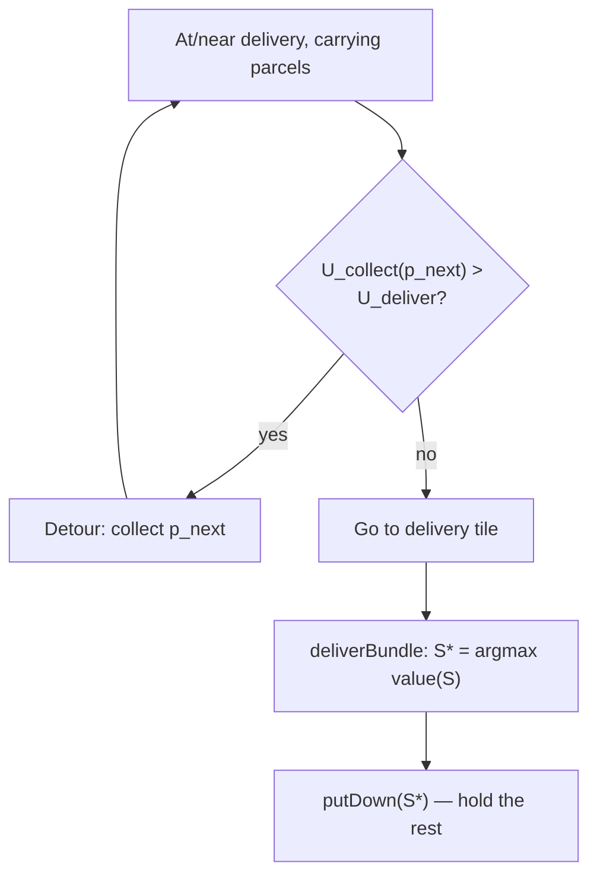

### 6.2 Two hard guards (not utility-weighted)

1. **Reachable counts.** There is no carry capacity, so every `m(k)` tier is in principle reachable; the only practical bound is the number of parcels currently held. A tier `m(k)` simply stays dormant until the agent is carrying ≥ `k` parcels — no compile-time striking needed.
2. **Expiry floor.** Never hold a stack until a carried parcel decays to 0. If any carried parcel is projected to expire within a few ticks, force its delivery regardless of the bonus.

---

## 7. Hard constraints

Two flavours, both collapsing into existing machinery — there is **no special resolver**.

### 7.1 Priced constraint → A\* edge toll

*"Do not go through (x,y) or lose 50."* Entering is allowed but costs 50, in the same currency. Add the toll to the A\* step cost of entering that tile:

$$
\text{cost}(\text{enter } t) = c_\text{tick} + \begin{cases} \text{toll}(t) & \text{if } t \text{ is priced} \\ 0 & \text{otherwise} \end{cases}
$$

Tolls are **points** while a step costs **a tick**, so the edge cost needs an explicit exchange rate — what one tick of travel is worth in points:

$$
c_\text{tick} = \underbrace{\rho \cdot \bigl|\{i \in S : R_\text{now}(i) > 0\}\bigr|}_{\text{carried-bundle decay per move}} \; + \; \underbrace{\bar{u}_\text{forgone}}_{\text{avg realised points/tick}}
$$

Without $\bar{u}_\text{forgone}$ (a slow running average of the agent's own realised delivery rate), an empty-handed agent has $c_\text{tick} \approx 0$ and A\* would take an arbitrarily long detour to dodge any toll. The toll is a **point penalty**, not extra ticks, so it subtracts from the numerator of the rate-based $U_\text{deliver}$:

$$
U_\text{deliver} = \frac{V(S^*, z^*, L) - \sum_{t \in \text{path}} \text{toll}(t)}{(L + 1)^\alpha}
$$

A\* minimises ticks-priced-in-points plus tolls, so the priced tile is taken only when the bundle value justifies it. Two consistency rules: **(a)** tolls load onto *every* planned leg — `U_collect`'s pickup→deliver cycle, exploration, contract legs — not just the delivery run; **(b)** `d(a,b)` elsewhere in this spec stays a *pure tick count* (the decay math in `V` needs real time), so the toll-aware search returns the chosen path's tick length `L` and its toll sum as separate numbers.

**Worked example.** Delivery at (8,2); the straight corridor crosses priced tile (5,2), toll 50; bundle worth 30 now. *(Assumed config for this example only: a single-parcel bundle decaying at `ρ = 1` point/tile — i.e. one carried parcel above its `R_now > 0` floor — so the "+6 tiles ⇒ ~6 decay" leg reads directly. The §6.0 and §9.8 examples instead use the default `ρ = 0.05`; the numbers here are not meant to be read against those.)*

| Option | Computation | Net |
|--------|-------------|-----|
| Go straight | 30 − 50 | **−20** → reject |
| Detour (+6 tiles, ~6 decay, no toll) | 30 − 6 | **+24** → take it |
| No detour exists, hold & keep collecting until bundle = 70 | 70 − 50 | **+20** → pay toll once on a fat bundle |

The last row is emergent: a recurring toll makes the agent **batch deliveries to amortise it**, and it composes with the stacking shaper (both push toward fewer, larger deliveries) with no extra rule.

### 7.2 Absolute constraint → `value(S)` filter

*"Deliver parcels with reward >10 → no reward"* / *"Deliver in (x1,y1) → 0 pts."* These nullify value rather than costing points. They become a predicate inside the existing bundle valuation:

$$
\text{value}(S) = \begin{cases} 0 & \text{if } S \text{ violates the filter} \\ m(|S|) \cdot \sum_{i \in S} r_i & \text{otherwise} \end{cases}
$$

The subset optimizer then never assembles a forfeiting bundle, and a zero-value delivery zone drops out of `reachableDeliveries` — no new code path.

### 7.3 The one explicit decision (no clarification allowed)

*"If you deliver parcels with score >10 you get no reward"* — does one bad parcel void the **whole `putDown`** or just that parcel? You cannot ask. **Bias to the worst case** (whole bundle voided). The conservative reading costs a little efficiency; the optimistic reading risks zeroing a real delivery. Asymmetric caution.

---

## 8. Coordination contracts

All joint missions are built on **one generic primitive**, not three bespoke ones.

### 8.1 The primitive: a step list of locals and barriers

- **LOCAL(agent, goal)** — one named party achieves something it verifies alone (reach a tile, pick a parcel, get onto an odd row).
- **BARRIER(condition)** — *all* parties block until a joint condition holds. The condition references **positions on different tiles** (two agents can never share a tile) or an external signal.
- **ACTION(agent, primitive)** — an atomic game action (`putDown`, `pickUp`).

Both agents run the **same** step list, execute only their own steps, and block on every barrier. Advancement uses shared, **monotonic** bookkeeping (`posted`): each party flips its flag true on reaching a milestone, and each agent *independently* observes when a barrier releases — so they advance in lockstep with no central controller, and one tick of a2a latency only postpones a release, never corrupts it.

```
Contract {
  id       : string
  type     : RENDEZVOUS | HANDOFF | SYNC_GATE     // selects the template
  parties  : { agentId → role }                    // bound by runtime bid, not LLM
  steps    : [ LOCAL | BARRIER | ACTION ... ]
  cursor   : index into steps
  posted   : { agentId → milestoneReached }        // barrier bookkeeping
  params   : { tiles RUNTIME_BOUND, parcel, gateSource, ... }
  payoff   : number
  deadline : tick                                  // every barrier is bounded
  status   : PROPOSED | COMMITTED | ACTIVE | SATISFIED | FAILED | ABORTED
}
```

### 8.2 Contract lifecycle

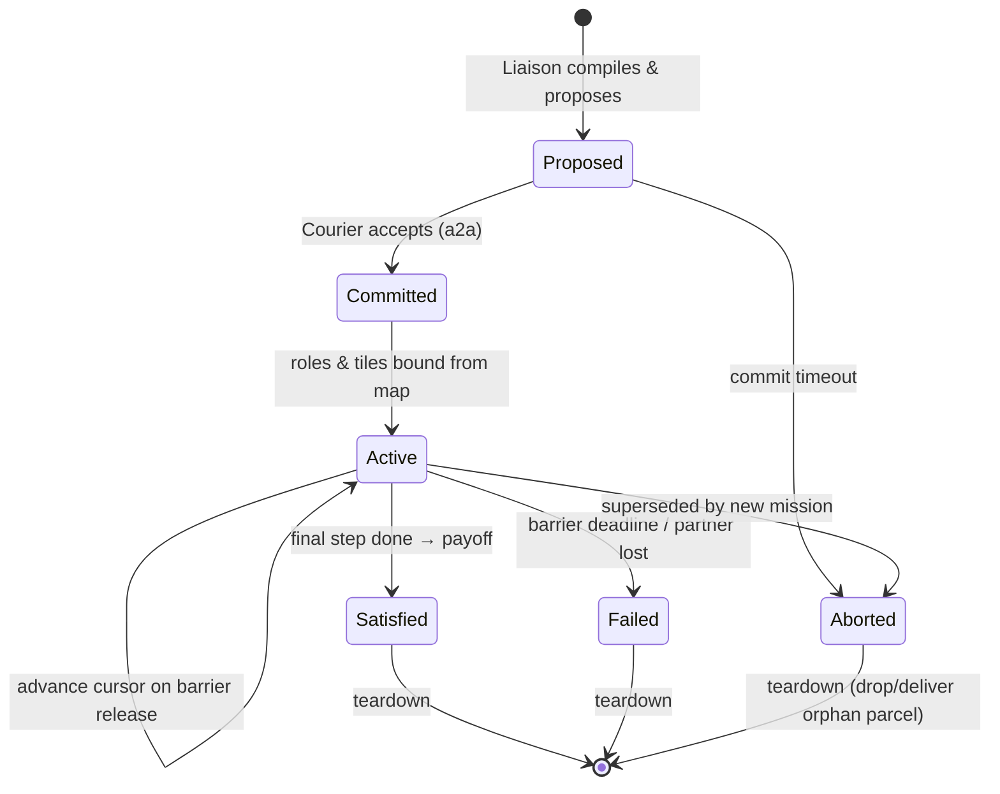

> The LLM emits the contract **coordinate-free** (it knows no map). Roles come from the contract-net bid (§9); every tile is `RUNTIME_BOUND`.

### 8.3 Example A — Handoff ("+200 if a different agent delivers")

Parcel `p1` at (2,2); only delivery zone at (8,2); Liaison at (1,2), Courier at (7,2). Runtime bid: Liaison is closer to `p1` → **picker (A)**; Courier closer to delivery → **deliverer (B)**. Drop tile bound to (7,2), adjacent to delivery. **Agents never share a tile** — the transfer is drop-and-vacate.

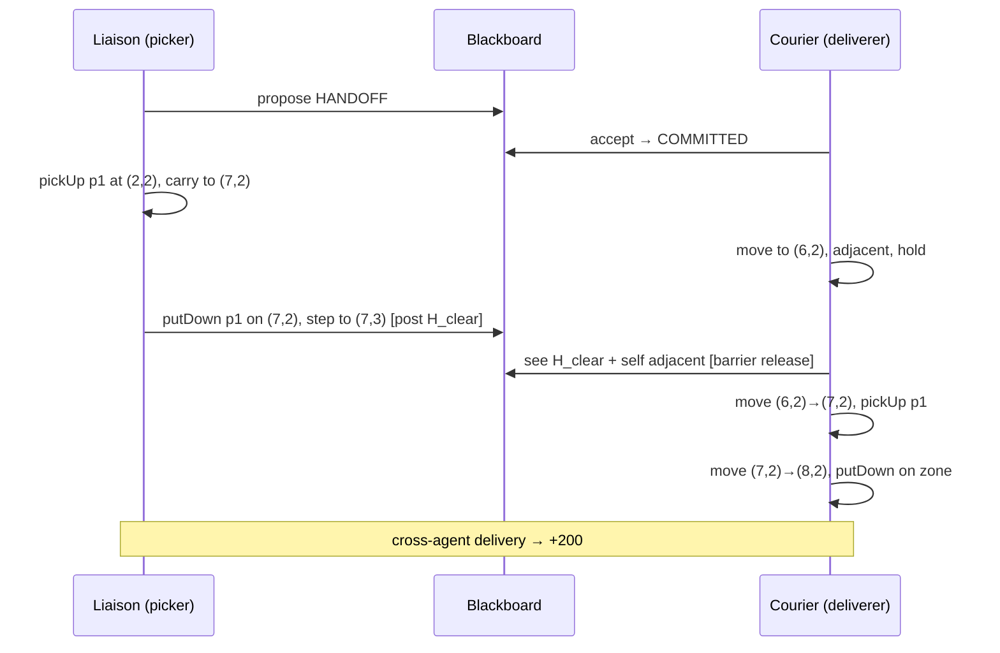

The drop tile is chosen next to delivery so `p1` sits uncarried for only one tick — minimal exposure to decay and enemy pickup.

Two binding rules make the handoff sound: the contract's `ACTION(putDown)` always carries **explicit ids** (`putDown([p1])`) — A may be carrying base-play parcels it must not dump on the corridor — and the runtime-bound drop tile must be a **non-delivery** tile (a delivery tile would score the parcel for A solo, voiding the cross-agent condition) with a free vacate tile for A and an approach tile for B; if no tile satisfies all three, the bid is declined.

> **Confirmed mechanic:** `putDown` **on** a delivery zone scores and removes the parcel; `putDown` **anywhere else** drops it on the ground (`carriedBy=null`) where it persists and can be re-picked by any agent. This is the platform's actual behaviour (see `game-rules.md`, `putDown`), so both the handoff (§8.3) and the #3 drop-and-recover strategy (§14) rest on solid ground.

### 8.4 Example B — Rendezvous ("both within distance 3 of (x,y) → +500")

A single barrier; agents occupy **different** tiles inside the neighbourhood.

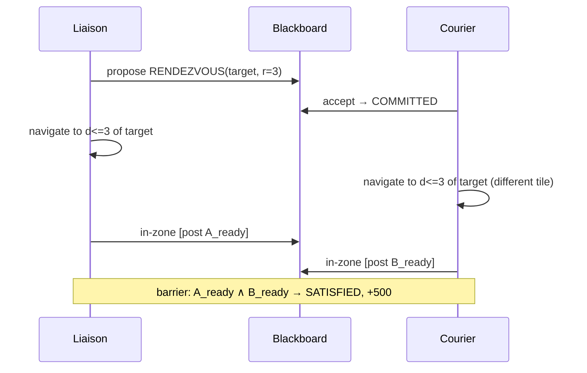

> Ambiguity default: "wait for each other" is read as **stay within the radius**, not freeze — so an agent may opportunistically grab parcels inside the zone while waiting (strictly dominates idle waiting, can't break the barrier).

> Distance metric: the in-zone predicate uses the **server's own metric** (however the platform defines "within distance 3"), never A\* path length — path length ≥ straight-line distance, so the conservative check could leave the barrier unsatisfied (payoff forfeited) on maps where the server would already credit it. A\* is for routing *into* the zone only.

### 8.5 Example C — Sync-gate ("red light / green light" → +700)

A **re-arming** barrier driven by the server, implemented as a shared `gate` flag the Liaison toggles from the chat channel; both agents' execution layer checks it before every move.

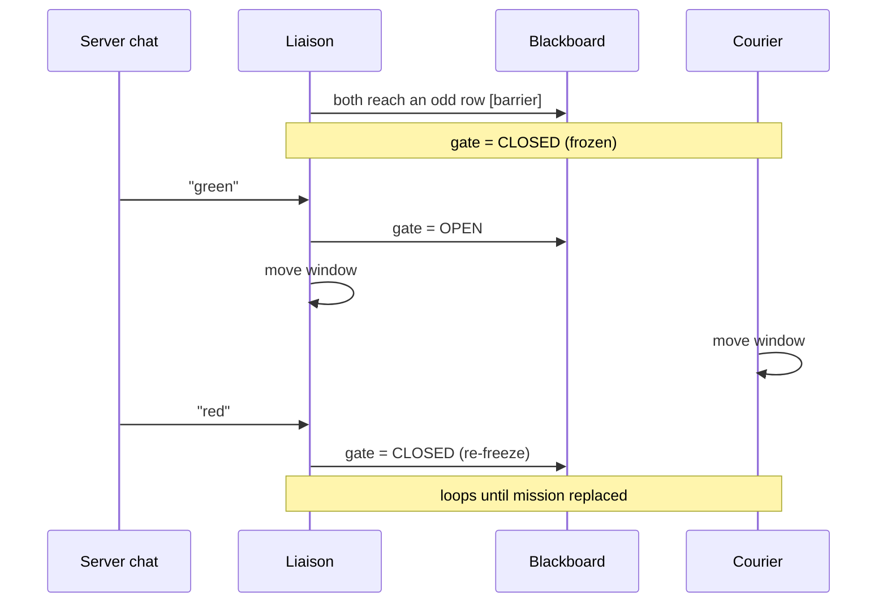

**Close-latency guard.** Barrier *releases* tolerate a2a lag (a late release only postpones). A late gate **close** does not: "red" travels server → Liaison → blackboard → Courier, and any move in that window is a violation. The execution layer therefore fails safe — an agent moves only if the gate is `OPEN` **and fresh** (heartbeat within `GATE_STALE_TTL`); a stale flag reads as `CLOSED`. Exposure shrinks to at most the one in-flight move the platform completes anyway.

**Gate scoping — the check is live only under an active SYNC_GATE contract.** The fail-safe above (stale ⇒ `CLOSED`) must not freeze the agents when no sync-gate is running. The `gate` field defaults `OPEN`, but the **freshness check and its `GATE_STALE_TTL`** are armed **only while a `SYNC_GATE` contract is `ACTIVE`** for this agent; outside that window the execution layer ignores `gate` entirely and moves normally. Otherwise a missing heartbeat (no mission, dead Liaison) would read as a permanent `CLOSED` and lock both agents out of base play — the exact opposite of "Courier keeps full base play" (§11).

**Partner loss tears the contract down (and clears the gate).** The sync-gate is the one contract with no pending barrier whose `BARRIER_DEADLINE` could trip (it "loops until mission replaced", above), and only the Liaison can compile a replacement — so without an explicit rule a dead Liaison would leave the Courier frozen on a stale `CLOSED` gate forever. Rule: **partner-loss detection** (the heartbeat/a2a liveness signal already used for `GATE_STALE_TTL`) failing for the *partner* — not just the gate source — **aborts the `SYNC_GATE` contract** (`Active → Failed`, §8.2), which on teardown **clears `gate` back to `OPEN`** and disarms the check, returning the survivor to full base play. This is the sync-gate instance of the general "blocked or deleted partner fails the contract" rule (§8.6) — made explicit here because the perpetual gate has no other deadline to rely on.

### 8.6 Liveness & opportunity cost

- **Commit timeout:** if the Courier doesn't accept, abort — never strand the Liaison waiting.
- **Every barrier has a deadline:** a blocked or deleted partner fails the contract; both tear down and resume base play. No deadlock.
- **Combined opportunity cost:** because both couriers are committed, the Liaison adopts a contract only when `payoff > combined forgone base utility of both agents` over its duration. +500 rendezvous usually clears it; +200 handoff might not, depending on current loads.
- **Execution-time urgency uses the *next* barrier, not the whole contract.** Adoption (above) is a one-time decision; once `ACTIVE`, the deadline that drives the per-tick urgency term (`s_m`, §5.5) is the **nearest binding** one — the next barrier's deadline (§8.1, every barrier is bounded), with `L_m` the distance to satisfy that next milestone, not the final payoff step. So a multi-barrier contract escalates one gate at a time: the agent commits to reach each barrier just before its slack runs out, banks roadside points in between, and a missed barrier fails the contract via its own deadline (§8.2). A plain mission with a single `deadline` (§4.2) is the degenerate one-barrier case.

---

## 9. Normal-play orchestration — team-optimal task allocation

With no mission active, orchestration has exactly one job: make two selfish rate-maximisers behave as a single **team** maximiser. The objective is now explicit — the quantity the whole section optimises:

$$
U_\text{team} = \sum_{\text{agent } X} \bigl(\text{realised points/tick of } X\bigr)
\qquad \text{(R1; also the offline-calibration metric, §16.2)}
$$

Three layers deliver it, each riding machinery already in the design — no bespoke resolver:

1. **shared beliefs** (§2.3) — already present;
2. a per-tick **marginal-route auction** that assigns each parcel to the agent whose current route it improves most (§9.3);
3. a periodic **global rebalance** that swaps assignments when the team gains (§9.6).

Plus one clean rule that removes a long-standing double role: the **partner is a collaborator** (coordinated through claims), the **enemy a competitor** (priced through `raceDiscount`) — §9.4.

> In BDI-only mode the two agents are symmetric peers; the Liaison/Courier asymmetry (§2.1) concerns only the mission channel, which is idle here. Everything below is leader-less.

### 9.1 Why private rate ≠ team rate

The single-agent selector (§5.5) maximises each agent's *own* points/tick. Summed, that is team-optimal only if the two never contend and never leave route synergies on the table — and in general they do both. Two distinct failures:

- **Contention.** Both `argmax` the same hot parcel and collide, or one wastes a losing chase.
- **Lost synergy.** A parcel cheap for A to fold into a route it is already flying is an expensive detour for B; a per-parcel valuation that ignores each agent's standing plan cannot see this.

The auction (§9.3) removes contention; marginal-route bidding (§9.2) captures synergy.

### 9.2 One value metric — the marginal-route bid

Each agent holds a **route**: an ordered sequence of pickups ending in a delivery (its current planned cycle). A route's value is the rate-based value of that whole pickup→deliver cycle, evaluated with the kernel `V` (§5.4):

$$
U_\text{route}(\text{route}) = \frac{V(S_\text{route},\, z_\text{route},\, L_\text{route})}{(L_\text{route} + 1)^\alpha}
$$

with `S_route` the set delivered, `z_route` the chosen zone, `L_route` the route's tick length. The bid on a parcel `p` is the **marginal** gain from inserting it at its cheapest point:

$$
\Delta_X(p) = U_\text{route}\bigl(\text{route}_X \oplus \text{bestInsert}(p)\bigr) - U_\text{route}(\text{route}_X)
$$

This is the design's **single** value metric, not a new one beside `U_collect`. `U_collect(p)` (§5.5) is exactly `Δ` over a length-1 route (`carried ∪ {p} → z`); it survives in the text only as that special case — the same move by which `U_collect` already subsumed the deleted standalone `U_stack`. Bidding the *marginal* (not the absolute route value) is what makes greedy assignment track the team optimum: since `U_team` is a sum, assigning `p` to `argmax_X Δ_X(p)` is the locally team-optimal move — each agent bids its own contribution to the sum.

**Emergent horizon (no fixed `k`).** A route is not capped at a parcel count. It extends only while `U_route(grab one more) > U_deliver` and terminates exactly where the rate comparison says "deliver now" — the hold-vs-collect decision of §6.1, one level up. Far-future legs barely move the argmax anyway: `P_surv` halves every ~3 decay intervals (§5.3), so distant pickups are pre-discounted to near zero. Routes stay short, insertion search stays cheap, the plan stays stable. An agent **claims only parcels inside its current cycle**; anything beyond stays in the pool for the next auction — consistent with soft, expiring, non-hoarding claims.

**`bestInsert(p)`, concretely — greedy cheapest-insertion.** A route is an ordered pickup sequence `π = ⟨q₁,…,qₙ⟩` ending in one delivery at `z_route`; its tick length is the sum of the leg costs along `self → q₁ → … → qₙ → z_route`. `bestInsert(p)` tries `p` in each of the `n+1` pickup gaps and keeps the placement that maximises `U_route` of the extended route. For the gap between `qᵢ₋₁` and `qᵢ` the marginal travel is the classic detour

$$
\Delta L_i(p) = d(q_{i-1}, p) + d(p, q_i) - d(q_{i-1}, q_i)
$$

with every `d(·,·)` a **pure tick count** from the same toll-aware A\* used everywhere (§7.1 rule (b)). The delivered *set* `S_route` is insertion-order-invariant, so the count/location shapers in `V` don't move with the order — insertion only trades off travel-and-toll, while `V` carries value. The search is `O(n)` placements, each two A\* legs, with `n` held small by the emergent horizon above, so it stays in the hot loop. Greedy can lock in a sub-optimal order; that regret is **not** repaired inside the route but by the periodic global rebalance (§9.6), which is exactly the 2-opt-style correction layer — keeping per-tick insertion cheap and the plan stable.

**`z_route` is re-chosen on every tentative insertion, from the tail.** Folding `p` in changes the carried set and can change the route's tail, so the best drop zone can move with it. After each candidate placement `z_route` is recomputed by the §6.0 value-aware rule — `argmax` over reachable zones of the travel-decayed kernel — but measured **from the route's last pickup `qₙ`, not from `self`**, since that is where the agent actually departs for delivery:

$$
z_\text{route} = \underset{z \in \text{reachableZones}}{\operatorname{argmax}}\;
\frac{V\bigl(S_\text{route},\, z,\, d(q_n, z)\bigr)}{d(q_n, z) + 1}
$$

So `bestInsert(p)` is really an `argmax` over **(gap, zone)** pairs: a 5× zone pulls the whole route toward it, a 0× zone never wins (§6.0). The recompute is an argmax over a handful of zones, dominated by the per-leg A\* it sits beside, so it costs `O(n·|\text{zones}|)` with both factors small. `U_collect`'s single-parcel zone pick (§6.1) is the `n = 0` case of this rule.

**Tolls load onto the whole route.** Each leg's `(L, tollSum)` comes from the toll-aware A\* (§7.1 rule (a): tolls price *every* planned leg, not just the delivery run), and the route's toll sum subtracts from the kernel exactly as in `U_deliver` (§7.1):

$$
U_\text{route}(\text{route}) = \frac{V(S_\text{route},\, z_\text{route},\, L_\text{route}) \;-\; \sum_{t \in \text{path}(\text{route})} \text{toll}(t)}{(L_\text{route} + 1)^\alpha},
\qquad L_\text{route} = \textstyle\sum_\text{legs} L_\text{leg}
$$

A route threading a priced tile is therefore bid lower and assembled only when the extra bundle value clears the toll — the batch-to-amortise behaviour of §7.1, now at route granularity. `L_route` and `tollSum` stay separate numbers (§7.1 rule (b)): the decay math in `V` needs real ticks, the penalty stays in points.

### 9.3 The marginal-route auction (every tick / on material change)

A **sequential single-item (SSI) auction** — a contract-net refinement — runs on the blackboard whenever beliefs change materially (new parcel, claim completed, parcel lost):

```mermaid
sequenceDiagram
    participant A as Agent A
    participant BB as Blackboard
    participant B as Agent B

    Note over A,B: pool = unassigned, pickable, non-MISSION-locked parcels
    loop until pool empty or AUCTION_BUDGET spent
        A->>BB: Δ_A(p) for every p in pool
        B->>BB: Δ_B(p) for every p in pool
        Note over A,B: commit global-best (p*, X*); deterministic id tie-break
        Note over A,B: X* inserts p* into route → claim{p*, X*, tick, origin=AUCTION} (bid carries the epoch)
        Note over A,B: re-bid pool (every Δ shifted by X*'s new route)
    end
```

- **Rounds, not one-shot.** Each round commits the single best `(p*, X*)` over the whole pool, `X*` folds `p*` into its route, then the pool is re-bid because every remaining `Δ` shifts with `X*`'s changed route. This is what lets two parcels on one path be allocated *as a route* instead of as independent claims.
- **Leader-less & deterministic.** Both agents run the identical loop on the shared belief replica → identical result, no negotiation round-trip; ties break by agent id.
- **Epoch-tagged, race-free.** Bids carry the auction epoch; an agent claims after seeing the partner's same-epoch bid or after `BID_WAIT`. Replica lag may yield two claimants — resolved deterministically (lower id keeps it), so a double-chase lasts ≤ 1 tick.
- **Anytime.** Bounded by `AUCTION_BUDGET`; on timeout, leftover pool parcels stay unassigned this tick and are bid next tick — never a frozen loop.
- **Roles too.** The same bidding machinery binds **roles** inside coordination contracts (§8.3) — but only **once**, at contract commit; the result is frozen in `contract.parties` and never re-bid per tick (§9.10).
- **Mission-locked parcels are out of the pool.** The pool excludes any parcel held by an `origin = MISSION` claim — the active mission/contract owns it for its lifetime and the auction may not contest or reassign it (§9.10).

### 9.4 Partner is a collaborator, enemy is a competitor

For combined score the partner must not be modelled as a rival. A parcel **claimed by the partner** gets `P_avail = 0` for me — identical to a parcel `carriedBy` another agent: spoken for, off my candidate list. `raceDiscount` (§5.3) therefore ranges over **enemies only**. So cooperation flows through claims (we divide the work), competition through the discount (we cede losing races to enemies), and a parcel is never double-charged as both "my partner might grab it" *and* "I should fight for it." (This is the §5.3 cleanup; the old partner-as-fallback-competitor note is removed there.)

### 9.5 Dispersion (soft)

A small repulsion keeps the two agents covering different ground — more map explored, less mutual blocking on one-agent-per-tile corridors and shared delivery zones:

$$
\text{bonus} \mathrel{+}= \theta_\text{disp} \cdot \text{awayFromPartner}(\cdot)
$$

added to `U_explore` regions and to delivery-zone choice (§6.0), pushing each agent toward regions/zones the partner is *not* heading for. Its magnitude is **tie-break-only** — it orders near-equal options, never overrides real value.

**`awayFromPartner(·)`, concretely.** The repulsion reads the partner's *intention*, not its pixels: `partnerTarget` is the head of the partner's route (its next pickup, or its `z_route` when it is already delivering), taken from the shared beliefs (§2.3). For a candidate region/zone `x` the term is a bounded, monotone-increasing distance from that target:

$$
\text{awayFromPartner}(x) = \min\!\left(1,\; \frac{d(x,\ \text{partnerTarget})}{D_\text{ref}}\right) \in [0, 1]
$$

with `D_ref` the map diameter — an a-priori constant, so the only knob is `θ_disp`, which already exists (§12). Bounding it in `[0,1]` is what keeps `θ_disp · awayFromPartner` tie-break-sized.

**Why this does not duplicate `staleness` (§5.5).** The two are orthogonal axes, not the same signal under two names:

- `staleness(r)` is **temporal and partner-independent** — the mean age of `r`'s tiles since *anyone* last saw them (from the `lastSeen` stamps). It says *go where the information is old*.
- `awayFromPartner(x)` is **spatial and instantaneous** — distance from where the partner is heading *right now*, independent of how recently `x` was observed. It says *go where your teammate is not*.

They can point the same way or opposite ways, and both are correct: a region that is stale **and** near `partnerTarget` is one the partner is about to refresh, so dispersion rightly damps my pull there even though staleness alone would draw me in; a region that is fresh **and** far from the partner gets a dispersion nudge that staleness would never give. Because `θ_disp` is small and the term is capped, even a mild correlation between the two can only reorder near-ties — it never overrides the real value either signal carries.

It is also the graceful-degradation target: if the a2a channel drops and `partnerTarget` is unknown, dispersion hardens into static **map-region ownership** (each agent prefers parcels in its half) — worse, but needing no live coordination.

### 9.6 Periodic global rebalance

The SSI auction is greedy and sticky: early commitments can be regretted as the parcel field evolves (a cluster spawns next to an agent already committed elsewhere). Every `REBALANCE_PERIOD` ticks, and whenever an agent finishes its route, a global pass runs over the **union of both agents' assigned-but-not-yet-picked** parcels and considers 2-opt-style swaps and transfers between the agents. A swap is accepted only if

$$
\Delta U_\text{team} > \text{switchCost}
= \underbrace{(\text{travel already spent toward the abandoned parcel})}_{\text{forfeited}}
\; + \; \underbrace{(\text{the other agent's re-approach})}_{\text{re-incurred}}
$$

both sides in points/tick — the same currency as everything else. The hysteresis is therefore **derived from physics**, not a tuned margin: a parcel an agent is already close to has a high switch cost and sticks on its own; one it has barely started toward moves freely. This is the inter-agent analogue of the private `h_commit` (§5.6), living at the shared coordination level where `h_commit` cannot (§9.7). **Picked-up parcels are never reassigned** — a swap would mean dropping carried goods. **Mission/contract-locked parcels never enter the union either** (`origin = MISSION`, §9.10): the mission's allocation is immune to rebalancing for its lifetime.

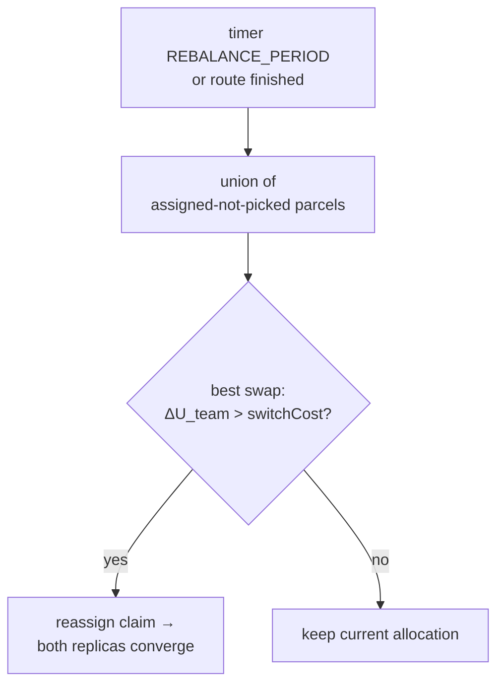

### 9.7 Canonical plan vs. private execution; triggers & degradation

The route used for **coordination** (auction + rebalance) must be a deterministic function of *shared* state only — claims, beliefs, config — so both replicas reconstruct each other's route identically and the leader-less consensus holds. This is the §2.3.2 stored-vs-derived discipline: claims are **stored**, routes are **derived**, never published as blackboard state. Private hysteresis (`h_commit`) is therefore **excluded** from the canonical plan and applied only on top, at execution, when the agent picks which step to take this tick. Two stability levels, no third knob:

- **shared / coordination:** the points/tick `switchCost` (§9.6), with `CLAIM_TTL` as a separate **liveness** backstop — a claim with no progress expires and re-enters the auction, so a stuck agent cannot hoard.
- **private / execution:** `h_commit` (§5.6), unchanged.

| Trigger | Action |
|---------|--------|
| Material belief change (new/lost parcel, claim completed) | re-run SSI auction (epoch-tagged) |
| `REBALANCE_PERIOD` elapsed, or an agent's route finished | run global rebalance pass |
| Conflicting claims under replica lag | deterministic lower-id yield; double-chase ≤ 1 tick |
| Partner lost / a2a dropping | each runs auction + rebalance on its own replica; allocation degrades to static region ownership (§9.5) |
| Auction/rebalance over budget | anytime fallback: keep current allocation, finish next tick |

Because every layer is leader-less and runs on a local replica, a dead partner removes bids but never the mechanism: the survivor wins everything reachable and keeps full play (§11).

### 9.8 Worked example — synergy assignment, then a rebalance swap

Three parcels worth 10 pts, `ρ = 0.05`, `α = 1`. A carries one parcel en route to zone Z; its path passes 1 tile from `p1`. B is empty, 8 tiles from `p1`. A later event: a cluster `{p2,p3}` spawns adjacent to B.

| Step | Computation | Outcome |
|------|-------------|---------|
| Auction `p1` | `Δ_A`: ~2-tick insert into A's route (cheap) ≫ `Δ_B`: ~8-tick detour | `p1 → A` (synergy, not "fewest assigned") |
| Cluster spawns | `{p2,p3}` nearest to B, B's route still short | `{p2,p3} → B` |
| B had earlier won far `q` (8 tiles), 1 tick travelled | rebalance: `ΔU_team` (3 near vs 1 far) > switchCost (1 forfeited tick + A's re-approach to `q`) | **swap**: B drops `q`, takes cluster; `q` re-auctioned |
| Variant: B already 7/8 ticks toward `q` | switchCost (7 forfeited ticks) > `ΔU_team` | **no swap**: B finishes `q`; cluster waits for next auction |

The last two rows are the *same* rule producing opposite, correct behaviour — hysteresis straight out of the sunk travel, no tuned threshold.

### 9.9 The execution selector — route to next move

§9.3–9.7 decide *what each agent owns* (the auction writes `claims`; the route is derived from claims + beliefs + config, §9.7). This section is the other half: each tick, how an agent turns its owned route into the next concrete action, and how the non-route options compete for the same tick. It is the bridge from §9 back to the single-agent selector (§5.5).

**One productive candidate, three alternatives.** The deliver/collect machinery collapses into a single candidate `U_route` (§5.5 note, §9.2) — the rate of the agent's committed pickup→deliver cycle. The per-tick choice is the §5.6 argmax over exactly four candidates:

$$
\text{chosen} = \underset{\{\,U_\text{route},\; U_\text{mission}(m),\; U_\text{explore}(r),\; U_\text{idle}\,\}}{\operatorname{argmax}}\; U(\cdot)\times(1+h_\text{commit})^{[\text{committed}]}
\quad\text{s.t. } U>0,\ \text{plan valid}
$$

All four are already in points/tick (§5.5), so the comparison is unchanged — only the *productive* terms are now named by the route they belong to instead of being scored parcel-by-parcel. When parcels exist, `U_route`'s real-opportunity rate dominates `U_explore` (gated by `θ_explore = 0.3`, deliberately below real value) and `U_idle` (the `ε` floor); when the pool is empty or the agent's route is empty, `U_route` vanishes from the set and exploration or idling wins on its own. That is exactly how "explore competes with route execution" is meant to resolve — by rate, no special-case arbiter.

**Outcome → next move.**

| Winner | Next action this tick |
|--------|----------------------|
| `U_route` | first A\* step toward the route's head: the next pickup tile, or the chosen zone if the route says "deliver now" (§6.1) |
| `U_mission(m)` | the next step of the active mission / contract step list (§8.1) — a `LOCAL` move, an `ACTION`, or block on a `BARRIER` |
| `U_explore(r)` | one step toward region `r` (with the dispersion nudge, §9.5) |
| `U_idle` | hold position |

**Route internals are frozen between auctions.** The selector does *not* re-derive the route's pickup order every tick — it only ranks route-vs-mission-vs-explore-vs-idle and emits one step along an already-ordered route. The ordering is recomputed only on the §9.3 triggers (new/lost parcel, claim completed → re-run the SSI auction) or when the current plan goes invalid (§5.6: parcel vanished, path blocked). This is the canonical/private split of §9.7 made operational: the **route is the canonical, shared-derived object** (both replicas reconstruct it identically from `claims`); the **commitment bonus `h_commit` and the move emission are private**, applied here at execution and never published. Between auctions the agent simply walks the frozen route, which keeps the per-tick loop off the auction's cost and keeps the two replicas in agreement.

**Solo reduces cleanly.** With no partner there is no auction round-trip, but the same loop holds: the agent greedily builds a route (insert while `U_route(\text{grab one more}) > U_\text{deliver}`, §6.1), and the four-candidate argmax drives it. One code path serves one agent or two.

### 9.10 Mission/contract lock precedence — what the auction may not touch

The auction (§9), missions (§4), and contracts (§8) all reach for `claims`. The precedence rule that keeps them from fighting rests on one structural fact: **a coordination contract *is* a mission** — `kind = COORDINATION_CONTRACT` in the §4.2 schema, occupying the same single slot (§4.3). So there are not three subsystems contending for `claims`/`roles`; there is exactly one boundary, **the mission slot vs the auction**, and one rule across it.

**Claim origin.** Every claim carries who owns it:

```
claim { parcelId, agentId, tick, origin: AUCTION | MISSION }
```

- `AUCTION` claims are the soft, expiring, non-hoarding reservations of §9.2 — governed by `CLAIM_TTL` (§9.7 liveness backstop).
- `MISSION` claims are the parcels (and the bound parties) the active mission/contract needs. They are **locked**.

**What "locked" means.**

- **Excluded from the auction pool (§9.3):** the pool is *unassigned, pickable parcels that are not `MISSION`-locked.* The auction never bids a locked parcel, so it can never reassign or contest one.
- **Excluded from the rebalance union (§9.6):** alongside picked-up parcels, `MISSION`-locked parcels never enter the swap set. The mission's allocation is immune to 2-opt rebalancing.
- **Different liveness:** a `MISSION` claim does **not** expire on `CLAIM_TTL`. Its lifetime is the mission's `deadline` / `selfCheck` (§4.2) or the contract's `deadline` (§8.1) — the slot owns the lock for as long as it is `ACTIVE`.
- **Install supersedes, teardown releases:** when a mission installs (§4.3) it claims its parcels with `origin = MISSION`, overriding any prior `AUCTION` claim on them (precedence: MISSION > AUCTION). The `MISSION` locks are part of the mission's *installed effects*; on `SATISFIED`/`FAILED`/`SUPERSEDED` teardown they are released back to the pool for the next auction — same discipline as a torn-down shaper or tile toll.

**Scheduling is soft; ownership is hard — two separate mechanisms.** `U_mission` competes in the §9.9 selector for the agent's *attention this tick*, interleaving with base play: the agent pursues the mission parcel when `U_mission` wins, but is free to fold a roadside parcel `q` into its route when `U_route` wins. The auction keeps running **alongside** the mission for every non-locked parcel. What the auction may *not* do is touch the mission's reservation — that ownership is fixed for the slot's lifetime regardless of which candidate wins any given tick. Today's confusion is exactly the conflation of these two; the `origin` tag separates per-tick *scheduling* from lifetime *ownership*.

**Roles are bound once, not continuously auctioned.** The same bidding machinery that runs the parcel auction binds contract roles (§9.3 "Roles too"), but it runs **once**, at contract `Committed → Active` (§8.2), and the result is stored in `contract.parties` and frozen for the contract's life. Roles therefore never enter the per-tick auction and need no precedence rule — they are a one-shot output, not contended state.

### 9.11 Requirements coverage

| Req | Where |
|-----|-------|
| R1 (maximise combined score) | §9 intro (`U_team`), §9.2–9.6 |
| R23 (orchestration mechanisms) | §9.3 auction, §9.6 rebalance, §9.5 dispersion |
| R8 (a2a, graceful degradation) | §9.7 (leader-less replicas), §9.5 (region-ownership fallback) |
| R9 (adversarial enemies) | §9.4 (`raceDiscount` = enemies only) |
| Per-tick route→move execution; explore/idle/mission competition | §9.9 (four-candidate selector, frozen route internals) |
| Mission/contract vs auction precedence | §9.10 (claim `origin`, lock semantics, role binding) |

---

## 10. LLM cadence — strictly off the hot loop

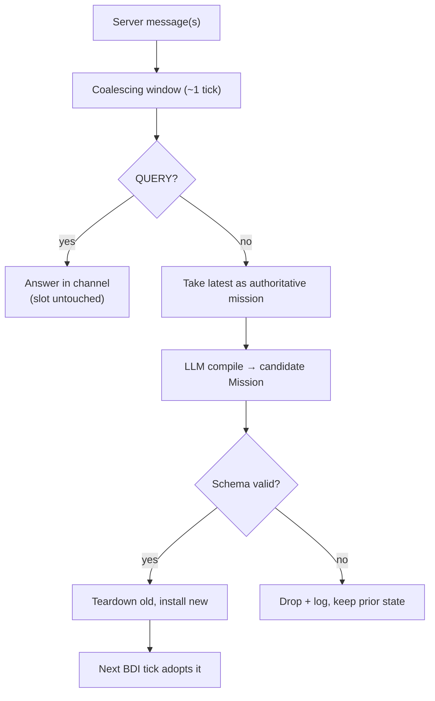

- **Trigger:** a server message wakes the async worker; it compiles, writes, sleeps.
- **Debounce a burst:** a short coalescing window collects close-together messages. The **latest** non-query becomes the active mission (overwrite semantics make earlier ones superseded); every `QUERY` in the burst is still answered individually.
- **Never blocks:** while the LLM compiles, both agents keep playing the currently installed mission (or none). A 2 s LLM latency costs at most 2 s of acting on the *old* policy — never a frozen agent.
- **Validation gate:** malformed compiles are dropped and logged; combined with runtime feasibility (`P_feasible`, map validation), a bad LLM call degrades to "no new mission", never to incoherent behaviour.

---

## 11. Failure modes & degradation

| Failure | Handling |
|---------|----------|
| No reward feedback (server confirms no payoff) | By design: missions run **open-loop** (§1). A misread is undetectable post-hoc, so prevention is the only defence — conservative compilation (§7.3) + `P_feasible` gate (§3.1); tuning is offline only (§16) |
| Liaison dies | Courier keeps full base play; only new-mission compilation stops |
| LLM latency / hang | Agents act on currently installed mission; new one adopted when it lands |
| Malformed LLM output | Dropped + logged; previous state intact |
| Transcribed coordinate invalid (wall/unreachable) | `P_feasible = 0`; mission ignored |
| Ambiguous payoff sign / hardness | Treat as constraint to **avoid** (asymmetric caution) |
| a2a messages dropping | Fall back to static region ownership for allocation |
| Contract partner blocked/deleted | Barrier deadline → contract `FAILED` → both resume base play |
| Mission overwritten mid-contract | Teardown: drop or deliver orphan parcel, clear gate, resume |
| Carried parcel about to expire mid-stack | Expiry floor forces delivery regardless of bonus |
| Gate flag stale during red/green (a2a lag) | Fail-safe: stale reads as CLOSED; agent freezes (≤ one in-flight move exposed). Check armed only under an active SYNC_GATE contract (§8.5) |
| Liaison/partner lost during sync-gate | Partner-loss aborts the SYNC_GATE contract → teardown clears `gate` to OPEN, disarms the check; survivor resumes full base play (§8.5) |
| Conflicting auction claims (replica lag) | Deterministic yield: lower agent id keeps the claim |
| Push destination occupied at execution (agent on it, or crate moved by other/enemy) | Invariant re-checks live state on the executed step (§15.1); push deferred, agent replans next tick |
| Both agents push into overlapping tiles same tick | Spatio-temporal reservation + lower-id priority (§15.3); loser defers and replans |
| Push-aware search exceeds the tick budget | Anytime fallback: treat crates as walls this tick and plan normally (§15.3) |

---

## 12. Configuration parameters (additions to single-agent spec)

| Parameter | Default | Description |
|-----------|---------|-------------|
| `STALE_TTL` | ~9 decay intervals | Parcel belief eviction age; by then `P_surv ≈ 0.125` (three halvings, §2.3.3). Not safety-critical — bounds memory only |
| `CLAIM_TTL` | ~10 ticks | Soft-claim expiry if no progress |
| `COMMIT_TIMEOUT` | ~20 ticks | Abort a contract proposal if partner doesn't accept |
| `BARRIER_DEADLINE` | per contract | Bound on any joint wait |
| `LLM_COALESCE_WINDOW` | ~1 tick | Burst-debounce window for messages |
| `P_FEASIBLE_MIN` | 0.3 | Feasibility floor: a mission with `P_feasible < P_FEASIBLE_MIN` is **dropped from the argmax** (`U_mission → 0`, §5.5), the discrete give-up. `P_feasible` itself is binary (0/1 reachability) for plain coordinate missions, continuous (survival × race, or plan-validity for `FALLBACK`) when the mission targets a specific parcel; for deadline-bound missions/contracts it also folds **arrival credibility** — zero once the deadline is unreachable (`s_m < 0`) and discounted just before by the a2a/replan uncertainty already tracked (§5.5), no new knob |
| `AMBIGUITY_BIAS` | avoid | Default for unclear sign/hardness |
| `GATE_STALE_TTL` | ~2 ticks | Gate heartbeat freshness; a stale flag reads as CLOSED (fail-safe) |
| `BID_WAIT` | 1 tick | Max wait for the partner's same-epoch bid before claiming |
| `REBALANCE_PERIOD` | ~15 ticks | Cadence of the global rebalance pass (§9.6); also fires on route completion |
| `θ_disp` | small | Dispersion weight — tie-break-only repulsion between agents (§9.5) |
| `AUCTION_BUDGET` | per-tick time slice | Anytime cap on the SSI marginal-route auction (§9.3); leftover parcels bid next tick |
| `PUSH_PLAN_BUDGET` | per-tick time slice | Anytime budget for push-aware search; on timeout, fall back to crates-as-walls (no fixed look-ahead horizon — §15.3) |
| push priority | lower agent id | Deterministic ordering for conflicting simultaneous pushes (§15.3) |

---

## 13. End-to-end summary

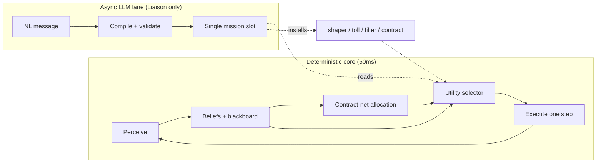

A fast deterministic BDI core plus a shared blackboard, with one async LLM lane that only ever drops a well-typed, validated mission into a single slot. Flexible enough to absorb arbitrary missions, with all spatial judgement, timing, and safety kept in the deterministic runtime where the map lives.

---

## 14. Coverage verification — all professor examples

Every example from the brief maps onto a mechanism above. None requires bespoke per-mission code.

| # | Example | Tier | Kind | Mechanism | Agent outcome |
|---|---------|------|------|-----------|---------------|
| 1 | Move to (4,7) → +10 | 1 | CANDIDATE_INTENTION | TEXT_BOUND tile, positive EV | pursues if EV-positive |
| 2 | Move to x=4\*2 y=(1+3)\*3 → −10 | 1 | CANDIDATE_INTENTION | formula evaluated → (8,12); negative EV | ignored (it's a penalty) |
| 3 | Drop a package in the leftmost tile → +5 | 1 | CANDIDATE_INTENTION | runtime predicate "leftmost"; plan pick→go→putDown | pursues iff +5 > parcel opp. cost |
| 4 | Drop a package in the leftmost tile → −10 | 1 | CANDIDATE_INTENTION | same, negative EV | ignored |
| 5 | What is the capital of Italy? | 1 | QUERY | answered in channel | "Rome"; slot untouched |
| 6 | Calculate 5×5 | 1 | QUERY | calculator tool (not LLM arithmetic) | "25" |
| 7 | Stacks of exactly 3 → double | 2 | REWARD_SHAPER | `m(3)=2`; `deliverBundle` + `U_collect` | batches to 3 |
| 8 | Stacks of exactly 5 → 0.3× | 2 | REWARD_SHAPER | `m(5)=0.3`; subset optimizer | never delivers 5 at once |
| 9 | Deliver in (x1,y1)/(x2,y2) → 5× | 2 | REWARD_SHAPER | `g(tile)=5`; value-aware zone selection | routes to the 5× zone |
| 10 | Deliver in (x1,y1) → 0 | 2 | REWARD_SHAPER / absolute | `g(tile)=0` | avoids that zone |
| 11 | Deliver parcels >10 → no reward | 2 | HARD_CONSTRAINT (absolute) | `value(S)=0` filter | delivers only $\leq 10$ bundles |
| 12 | Don't cross (x,y) → −50 | 2 | HARD_CONSTRAINT (priced) | A\* edge toll 50 | detour / batch / eat, by EV |
| 13 | Both within d<=3 of (x,y), wait → +500 | 3 | CONTRACT — RENDEZVOUS | step list + barrier | both converge and wait |
| 14 | Picked by one, delivered by other → +200 | 3 | CONTRACT — HANDOFF | drop-and-vacate + adjacency barrier | cross-agent delivery |
| 15 | Odd row + red/green light → +700 | 3 | CONTRACT — SYNC_GATE | shared `gate` flag toggled from chat | freeze / move on signal |

**Gap found and closed during verification:** the original §6 modelled only count-based multipliers `m(k)`, which left example #9 (location-based 5× zones) uncovered. §6 now carries a second location map `g(tile)` and value-aware zone selection (§6.0), so #9 and #10 are first-class. All other examples were already covered.

**Two examples worth a note, not a gap:**

- **#3 (drop for +5):** because an off-delivery `putDown` leaves the parcel on the ground (see the mechanic assumption in §8.3), the agent should **drop-and-recover** — `putDown` at the leftmost tile to bank the +5, `pickUp` the same parcel on the next tick (it never leaves the agent's tile), then deliver it normally for full reward. Net: **+5 plus** the delivery value, no forfeiture. The EV check only gates the *detour cost* to the leftmost tile, not the parcel itself. (Assumes the +5 credits once on a non-delivery drop; if it were repeatable it could be farmed, which the platform presumably caps.)
- **#2 / #4 (negative payoffs):** the only requirement is transcribing the sign correctly; the selector then never pursues them. Ambiguous signs default to "avoid" (§7.3).

---

## 15. Crate handling — admissibility invariant & adaptive coordination

Crates are an **A\* concern only**. The BDI core never reasons about them; it consumes the tick-length `L` the path finder returns. Two ideas keep this clean and **map-agnostic** — they assume nothing about how often crates must be pushed, whether value is sealed behind them, or how crates are laid out:

1. a **safety layer** — one admissibility invariant, always on, checked against live state;
2. a **coordination layer** — pure optimization, adaptive, that never overrides safety.

The safety layer alone guarantees correctness. The coordination layer only improves efficiency; if it is idle, stale, or wrong, the worst case is a wasted move or a suboptimal path — never an irreversible mistake.

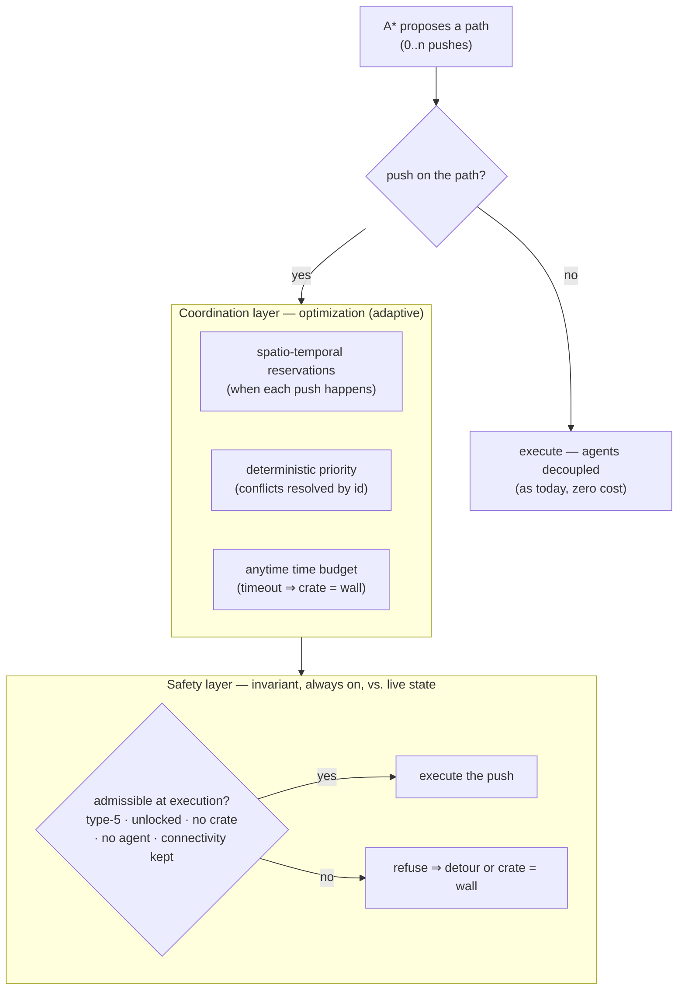

### 15.1 The admissibility invariant (safety layer)

A push is **admissible** iff, evaluated against the **live state at the tick it is executed**, all of the following hold:

1. **Game precondition** — the tile beyond the crate is type-5, unlocked, and **crate-free** (`game-rules.md`). The crate-free clause means a crate-against-crate push is never attempted; the path finder simply treats the front crate as a wall. (Maps observed so far never place two crates in the same pushable region, but the invariant does not rely on that — if such a map appeared, the push would just be inadmissible.)
2. **No agent on the destination** — a push into a tile occupied by another agent fails (the action is rejected and nobody moves — platform-confirmed). The path finder reads `beliefs.agents` for the destination tile.
3. **Connectivity preserved** — after the (hypothetical) crate move, the *protected set* — both agents' positions, every delivery zone, and every known parcel — remains mutually reachable (a flood-fill on the post-push grid). This is what makes a push safe for **both** agents without depending on the partner's plan: if everything stays connected, the partner can still reach anywhere it might want to go. Pushing to *open* a route only ever increases reachability; the check rejects only pushes that would *cut off* something currently reachable.

The invariant assumes nothing about the map. It is the same check whether pushes are rare or central, whether value sits behind crates or not.

### 15.2 Plan vs. execute — why per-tick replanning is safe

A push is irreversible (no pull), so replanning cannot *undo* a bad push. What makes per-tick planning safe is a different fact: **each tick the agent executes only the first step of its path.**

- If a push is the **first step**, it is validated against the live state now (no projection): the destination either is or isn't occupied, the crate either is or isn't where expected — known with certainty.
- If a push is **deeper in the path**, it is only *planned*, not executed. By the time the agent reaches it (k ticks later) it has become the first step and is revalidated against the live state of *that* tick.

Therefore projection — e.g. "that agent will have moved off the destination by the time I get there" — is legitimate **only in the coordination layer**, where it just helps *choose* a path. A wrong projection costs a suboptimal route, not a bad push. Projection must **never** authorize execution: the safety layer always re-checks §15.1 at the executing tick. For the partner, projected positions can be read from its blackboard plan (subject to one tick of a2a lag and plan volatility); for an enemy, no plan exists, so a push projected onto a currently enemy-occupied tile is penalized in the cost model and, if it is still occupied at execution, simply refused.

### 15.3 The coordination layer (optimization, adaptive)

When a planned path contains pushes, the coordination layer reduces wasted moves and lets safe parallel pushes happen. It reuses machinery already in the design (claims, epochs, deterministic tie-break — §9):

- **Spatio-temporal reservations.** A planned push is published on the blackboard as "crate at tile *Y* moves at tick *T*", so the partner can route around the timed obstacle. Pushes in non-overlapping regions don't interact and both proceed.
- **Deterministic priority.** If two planned pushes would touch overlapping tiles, the **lower agent id** wins and the other defers and replans — both agents compute the same winner with no live negotiation, exactly as parcel claims do.
- **Anytime time budget.** Push-aware search runs within the tick's time slice; there is **no fixed look-ahead horizon** (a horizon would be a map assumption). On timeout it falls back to **crates-as-walls** for this tick — always a safe, plannable state.

This layer scales with load on its own: **zero pushes ⇒ zero reservations ⇒ the two agents stay fully decoupled and fast, identical to base play.** Cost is paid only in proportion to actual pushing — pay for what you use.

### 15.4 Concurrency & shared-state writes

A normal move affects only the mover; a push **writes shared, irreversible state**. Three races, all caught by the same "revalidate against live state at execution" rule (§15.1), with the coordination layer merely reducing how often they bite:

| Race | Outcome |
|------|---------|
| Agent standing on the push destination | Precondition #2 fails at execution → push deferred, agent replans |
| Crate already moved by the other agent / an enemy | Precondition #1 fails (crate not where expected) → push refused, replan |
| Both agents push into overlapping tiles same tick | Spatio-temporal reservation + lower-id priority; loser defers (and the invariant still guards the winner) |

### 15.5 Scope & honest limits

What the design is agnostic about: the **frequency** of pushes and the **map layout**. What it deliberately does *not* promise: **completeness or optimality** in the worst case. Coordinating sequences of pushes between two agents is cooperative Sokoban (PSPACE-hard); no planner inside a 50 ms tick can guarantee finding a solution when one exists. The realizable agnostic guarantee is therefore **graceful degradation**: plan within the time budget, and if a crate problem isn't solved in time, fall back to crates-as-walls and proceed with what is reachable — never freeze, never act irreversibly on a guess. In the common case observed on real maps (at most one crate per pushable region, so crates don't interact), the search space stays small and no Sokoban solver is needed; the time budget rarely binds. That is reassurance about performance, not an assumption the correctness rests on.

---

## 16. Offline calibration & evaluation

The design carries a dozen hyperparameters (§5.8) plus structural thresholds (§12), all currently set to hand-picked defaults. Because the platform gives **no reward feedback** (§1), the **mission-related** values **cannot be tuned online** — there is no observed mission payoff to learn from at runtime. Calibration and validation of those must therefore happen **offline, in simulation**, before deployment. This is not optional: it is the only place where the defaults can be made defensible rather than guessed.

> **Observable exception — realised-delivery statistics.** Not every runtime quantity is blacked out. The agent's *own* delivery rate is ground truth (it sees its own pickups and putDowns), so `ū_forgone` (§7.1) and the clamp reference `ρ_ref` (§5.5) *are* legitimately maintained as runtime running averages — this is consistent with open-loop, which hides only *mission* payoffs, not base throughput. Everything in §16.1 below is the offline set; `ū_forgone`/`ρ_ref` are deliberately excluded from it because they self-calibrate from observable own-deliveries.

### 16.1 What must be calibrated

| Group | Parameters | What it trades off |
|-------|-----------|--------------------|
| Race / adversarial | `β_comp`, `λ_agent` | ceding contested parcels too eagerly vs. fighting losing races |
| Decay confidence | `λ`, `STALE_TTL` | trusting stale sightings vs. discarding still-valid parcels |
| Mission vs. base | `θ_mission`, `θ_explore`, `κ_info` | chasing missions/exploration vs. steady delivery |
| Stability | `h_commit`, `ε_idle` | thrashing between options vs. sticking to a stale commitment |
| Coordination | `CLAIM_TTL`, `COMMIT_TIMEOUT`, `BARRIER_DEADLINE`, `BID_WAIT` | coordination overhead vs. deadlock/double-chase risk |
| Constraints | `P_FEASIBLE_MIN`, `AMBIGUITY_BIAS`, `GATE_STALE_TTL` | false-reject of valid missions vs. unsafe pursuit |

### 16.2 Method

1. **Headless self-play harness.** Run both agents against the real Deliveroo.js server (or a faithful local clone) on a battery of maps — varied size, spawner density, crate layout, delivery-zone placement — with and without enemy agents.
2. **Scenario suite from the 15 examples.** Replay the professor's mission examples (§14) as scripted server messages and assert the expected behaviour (pursue/ignore/route/batch) emerges, since the agent itself gets no confirmation. The coverage matrix (§14) defines the pass/fail oracle.
3. **Objective = combined score.** The single metric is the team's combined delivered score over a fixed horizon (R1), averaged across seeds to absorb spawn/decay randomness. Secondary diagnostics: parcels delivered, idle ticks, contracts completed vs. failed, penalties accrued.
4. **Search.** Coordinate-descent or small grid/random search over the §16.1 groups; the parameters are few enough that exhaustive sweeps per group are cheap. Lock one group, sweep the next, iterate.
5. **Robustness check.** Confirm the chosen values are not knife-edge: perturb each ±20 % and verify the combined score degrades gracefully. A parameter the score is hypersensitive to is a design smell, not just a tuning target.

### 16.3 What this does *not* give

Offline calibration fixes good *static* defaults; it cannot adapt to a specific opponent or map at runtime (no feedback to adapt from). That ceiling is a direct consequence of the open-loop platform assumption (§1), not of the method — it is named here so the limit is explicit rather than discovered late.

---

## 17. The `FALLBACK` PDDL planning lane — detailed specification

§4.4 introduced `FALLBACK` as the sixth mission kind and stated the three contracts that bind it to the rest of this design (planner-below-selector, one shared push-aware cost estimator, one shared value scale). This section is the full specification of that lane: the marker that routes a mission into it, the atom-based PDDL pipeline, the plan lifecycle, and how it re-enters the utility core. It was previously a standalone companion document (`pddl-fallback-design.md`); it now lives here so the design is one self-contained artifact.

The lane handles missions whose *structure* none of the five typed kinds anticipates (a coverage goal, a constrained traversal, a multi-parcel ordering). It uses a classical PDDL planner to synthesise a plan from a fixed, versioned domain. The PDDL sits **below** the selector — it never replaces it; it supplies one more option (a plan and its length `L`) that competes in the single `U_mission` argmax. It is **not** the base navigation engine (point-to-point is plain A\*, §5.1/§15); it is the escape hatch for unseen mission *structure*.

### 17.1 Design invariants

1. **One decision point.** There is a single `argmax` in the BDI core (§9.9). The fallback enters as an *option* in that comparison, never as a parallel decider.
2. **The utility core is untouched.** The fallback adds an option; it does not change the selector or the other options.
3. **Open-loop.** The server never confirms payoff; the agent trusts the stated value, and there is no runtime verification of a mission's outcome (§1).
4. **No clarification questions.** An ambiguous or non-groundable mission is discarded, not queried (R13).
5. **The BDI loop never blocks.** LLM and planner run **outside** the 50 ms loop, asynchronously; the selector only reads ready results (§10).
6. **PDDL is a fallback, not a replacement.** The five typed kinds stay the fast path; PDDL covers only what the typed `Mission` structure does not encode.
7. **The LLM never writes arbitrary raw PDDL.** It selects from a validated vocabulary and transcribes goals/constraints; it authors neither the `:domain` nor the `:init`.

### 17.2 Where each kind lives

The six-kind taxonomy is §4; this is the routing view — which subsystem owns each kind. `LLM-Mission` classifies with **forced structured output** (constrained decoding), which guarantees *form* validity (the `kind` is always legal, dispatch is a deterministic `switch`) — **not** *semantic* correctness of the choice.

| Kind | Role | Lives in |
|---|---|---|
| `QUERY` | answer a question | typed fast path |
| `CANDIDATE_INTENTION` | candidate intention entering the argmax | typed fast path (utility model) |
| `REWARD_SHAPER` | reward reshaping (`m(k)` / `g(tile)`) | utility model — **never PDDL** |
| `HARD_CONSTRAINT` | constraint masking options; **tolls/prices live here** (sub `PRICED`), not in `REWARD_SHAPER` — they become edge costs in the `CostOracle` (§17.5.4), absolutes become masks | utility model |
| `COORDINATION_CONTRACT` | coordination agreement | utility model + synchronized step-lists (§8) — **never PDDL** |
| `FALLBACK` | none of the 5 fits → unseen mission | PDDL pipeline (this section) |

**Economic missions.** `REWARD_SHAPER` and economic contracts are *reward reshapings*, not goals. They stay in the utility model and never descend into the planner.

**Coordination.** `COORDINATION_CONTRACT` stays in the utility model: allocation via claims plus the synchronized step-lists of §8. PDDL is egocentric and cannot plan for two bodies (§17.8).

### 17.3 The "outside-the-5" marker and routing

**What the classifier emits.** Beyond `kind`, the schema imposes a **justification obligation** for the catch-all: the LLM may pick `FALLBACK` only by filling a field that lists the five typed kinds and says *why each fails*. Making the refuge class expensive to justify is the anti–*junk-drawer* guard: it cuts over-routing to `FALLBACK` out of laziness or uncertainty.

**Two routes into `FALLBACK`.**

1. **Explicit choice** by the LLM (`kind = FALLBACK` with justification).
2. **Objective grounding failure**: the LLM proposes a typed kind, but typed compilation fails to ground against live beliefs → escalate to `FALLBACK`.

Route 2 gives `FALLBACK` an *objective* trigger independent of the LLM's judgment; the escalation uses the abstract intent that call 1 emits regardless (§17.4). Before descending into PDDL, **exactly one** reclassification attempt is allowed with the failed kind excluded from the schema — a grounding-fail often means "the *second* typed kind was right", not "outside the five".

**The flag (single switch on the planning layer).**

- **OFF** → the PDDL layer does not exist at runtime. Out-of-the-5 missions → `NOT_APPLICABLE` → **discarded**. Pure utility core. This is the *conservative default* for never-seen missions: with no sound model, do not act.
- **ON** → planning layer live, **under a static-world assumption** (§17.7.4). Out-of-the-5 → `FALLBACK` → PDDL.

The `FALLBACK` vs `NOT_APPLICABLE` disposition is **runtime policy**, not classification: the LLM knows nothing of the flag.

**The non-falsifiable residue.** The dangerous misroute is the opposite of route 2: the LLM forces a genuinely novel mission into a typed kind that *grounds* but means the wrong thing. Grounding catches "references something absent", not "grounds but is semantically wrong". This **mis-fit is irreducible in open-loop**; it cannot be closed by another LLM check (itself non-falsifiable). It is **contained** downstream by the runtime safety net (§17.6.6). Two guards at different levels: the marker lowers the error's probability, the safety net bounds its consequences.

### 17.4 The two LLM-call pipeline

Both calls are asynchronous to the BDI loop.

- **Call 1 — `LLM-Mission` (semantics / classification).** Extracts the structured intent: `kind`, typed params, `payoff`, `theta`, priority. It **always** also emits the abstract intent (non-PDDL), whatever the kind — it is the input to call 2 when `FALLBACK` is reached via route 2 (§17.3), where otherwise nothing would exist to transcribe. One-shot, temperature 0, **cached by mission identity** (NL hash) — the same message always classifies the same way, no flapping.
- **Call 2 — `LLM-PDDL` (syntax / transcription).** Invoked **only** if `kind = FALLBACK` and the flag is ON. It selects atoms from the catalogue and transcribes the intent into grounded `:goal`/`:constraints`. It does not write `:init` and invents no atoms.

The **division of labour** (semantics vs syntax) localises failure: if no plan is found, you know whether it was the intent (call 1) or the transcription (call 2).

### 17.5 The PDDL pipeline (async, off the loop)

Linear pipeline: `PddlRequest → LLM-PDDL → InitBuilder → ValidationGate → PlannerClient → PlanCache`.

#### 17.5.1 The atom vocabulary

An **atom is a self-contained capability**, a bundle packaging three inseparable things:

```
Atom {
  pddlFragment          // contribution to the :domain (predicates and/or action schema)
  exposedVocabulary     // predicates the LLM MAY use in goals/constraints
  tier, role            // tags (high/low; action/predicate/constraint/goal-form)
  initObligation: (BeliefSet, bindings) -> { objects, facts }
  signatureContribution // which emitted facts are dynamic (for invalidation)
}
```

The LLM **selects** atoms from the catalogue and binds their parameters, then writes goals/constraints using *only* the predicates the selected atoms expose. Closure property: selection determines the vocabulary, the vocabulary bounds what can be written, grounding is the hard rule "every literal uses a predicate exposed by a selected atom".

**Auto-include.** If the LLM writes a literal whose predicate no selected atom exposes, the runtime **auto-includes** the atom that provides it (monotone, consistent with the over-include bias). It is safe because it fires only on a *written* literal (hence intended); the omission risk is the opposite (an *unwritten* constraint) and is covered by deterministic injection.

#### 17.5.2 The catalogue (three roles, not two equal tiers)

**Task atoms — the plan lives here (task level):**

- `TaskNav` → action `Goto(poi→poi)`, predicate `at-poi`, costs from the `CostOracle` (A\*).
- `TaskCollectDeliver` → `Collect`/`Deliver`, predicates `parcel-poi`, `delivery-poi`, `delivered`.
- `Ordering` → constraints `before(a,b)`, `priority`.

**CostOracle masks (formerly low-level constraints):**

- `KeepAway(targetPred, dist)` → dynamic exclusion.
- `StayOn(tileSet)` → static restriction.
- `Avoid(tile)` → expressible as `StayOn` of the complement, or a static `KeepAway` at `dist 0` (optional atom).

These are **not PDDL atoms**: they configure a **mask on the A\* graph** that computes `goto` costs. The constraint travels *inside the cost*, not in the plan — hence the `CostOracle` must be **constraint-aware**.

**Second application point (grid level).** Grid-level plans (`Coverage`) do not go through `goto` costs, so there the masks apply by **filtering the `walkable`/`adjacent` facts in `:init`**: `StayOn` = serialise only the set, `KeepAway` = omit tiles within `dist`. Same semantics, two injection points — without it, "cover X while staying away from Y" (exactly the prototype combination, requirement 12) has no mechanism. **Crates** (type-5 tiles, game-rules): the `CostOracle` **is the same push-aware A\* as the main design (§15)** — crates treated as pushable, with **crates-as-walls only as the anytime fallback** when push-aware search exceeds budget. It must *not* model them as permanent walls: doing so would give the same leg a different `L` than a typed mission would and skew the argmax (same estimator, same unit — §4.4, requirement 8).

**Pure grid — traversal goals only (grid level):**

- `GridNav` → `Move(tile→tile)`, predicates `at`, `adjacent`, `walkable`. `adjacent` is **oriented**: directional tiles (game-rules) make adjacency asymmetric — with symmetric adjacency, grid-level plans are illegal on those maps.
- `Coverage` → goal-form `visited`/`cover`.

Only `Coverage` (and similar traversal goals) genuinely needs the grid level. It is also where classical PDDL is *weak* (coverage is a hard problem): it might be better served by a hand-written sweep heuristic.

**Seam (shelved):**

- `PoiBridge` → predicate `poi-at(poi, tile)`. See §17.5.6.

#### 17.5.3 The `InitBuilder ↔ atoms` contract

Each atom declares its `initObligation`; the runtime runs it and unions the results. `InitBuilder` holds no per-mission logic, only the union:

```
activeAtoms = LLM_selection ∪ auto-included ∪ seam(if mixed) ∪ deterministic_constraints
objects     = ⋃ atom.initObligation(beliefs, bindings).objects   (dedup)
init        = ⋃ atom.initObligation(beliefs, bindings).facts      (dedup)
signature   = ⋃ atom.signatureContribution
```

Two non-negotiable pieces so the union is sound:

- **Shared name registry**: a deterministic belief-entity → PDDL-symbol function (tile (3,4) → `t_3_4`, parcel 7 → `p_7`, …). Every `initObligation` uses it, so different atoms speak of the same objects with the same symbols.
- **Region resolver**: maps a symbolic region name ("border", "left room") to concrete tiles against the map. A mini-vocabulary that must ground: an unknown region → grounding fail (and that is fine).

**No scoping.** Default: serialise the whole walkable graph. On "large but not huge" maps, often sparse/corridor-shaped, with latency dominated by the LLM calls (seconds), the planning delta is milliseconds — negligible. Moreover, **on the dominant path (task-level) the map never enters `:init`**: `:init` holds only POIs + `goto` costs. **The POI set is scoped to the mission** — entities referenced by the goal, delivery zones, `me`; not "all parcels" (parcels are unlimited — game-rules — and `goto` costs are all-pairs, O(P²) A\* runs per (re)plan). The map touches PDDL only in the `Coverage` case, already cropped to the goal's region. (Bounding-box scoping is also geometrically wrong for corridors; the correct box is the reachable subgraph, which for sparse maps ≈ the whole graph. Revisit only if profiling on a giant map shows grounding dominates.)

#### 17.5.4 `ValidationGate`

Checks in sequence:

1. **Parse** — PDDL syntax.
2. **Grounding** — every LLM literal resolves against domain ∪ init.
3. **Single-tier invariant** — the atom selection **does not mix** task atoms and grid atoms. If it does: bounce back to the LLM "pick one level", or `NOT_APPLICABLE`.
4. **Deterministic constraint injection** — belief-detectable `HARD_CONSTRAINT`s are forced here by the runtime, not left to the LLM's judgment (closes the silent-omission risk). **Semantic distinction:** *absolute* constraints become masks; *priced* constraints (tolls) become **edge costs** in the `CostOracle` (points→tick conversion via the per-step time-price of §7.1) — never masks, or the planner cannot choose to *pay* the toll when crossing is optimal (and might find no plan at all). When `goto` costs include tolls, extracting `L` separates ticks from toll-points (§7.1 rule (b)).

On **no-plan / grounding-fail**: **exactly one retry** of call 2 with the gate/planner error in the prompt — this is where the semantics/syntax split of §17.4 pays off; on the second failure → `PLAN_FAIL`.

#### 17.5.5 Planner, cache, invalidation

- `PlannerClient`: calls the external planner → `PlanResult { plan, L, found, timestamp, beliefSignature }`.
- `PlanCache`: keyed on `(missionId, intentHash, beliefSignature)`. The `beliefSignature` is the signature of *only* the beliefs that entered `:init`, **excluding the facts the plan itself mutates** (own position `at`/`at-poi(me,…)`, `delivered`, …): without that exclusion the plan would self-invalidate on the first executed step. The expected progression of those facts is tracked by the pointer (expected-vs-actual).
- `InvalidationWatcher`: watches that signature; on a change to a fact the plan uses → invalidate → re-trigger async planning.

#### 17.5.6 The two-level seam — collapsed, shelved

A *mixed* plan (alternating high-level `Goto` and low-level `Move` in one plan) would need to synchronise `at-poi` and `at` via `poi-at`, with `at-poi` made a **derived predicate** of `at`. But it has a **correctness trap**: a per-step constraint is checked *only* on the low-level-planned segments; on stretches covered by `Goto` the planner skips intermediate tiles and **does not check the constraint** — and since `Goto` is cheaper, the planner *prefers* it, silently bypassing constraints.

**Dissolution:** per-step constraints are graph masks → they go into the `CostOracle` (§17.5.2) and travel on task-level planning with no seam; traversal goals (`Coverage`) stand alone at the low level with no backbone to mix with. So the genuinely mixed plan barely exists.

**Decision: no seam in v1. Single-tier invariant** (§17.5.4 check 3). `PoiBridge` is built only if a truly mixed mission ever appears — and even then pushing the constraint into the `CostOracle` is preferred.

### 17.6 Reintegration into the utility core

#### 17.6.1 Formula

The fallback is scored by the **same unified `U_mission` as §5.5** — there is no second formula:

```
U_mission = min( θ · P_feasible · (payoff + V_plan) · max(1/(L+1)^α, 1/(s+1)^α),  c · ρ_ref )
s = deadline − t_now − L     # slack; no deadline ⇒ s = ∞, the urgency term vanishes
```

Same deadline-urgency term (v1.7), same `(payoff + V_plan)`, same rate ceiling `c · ρ_ref` (§17.6.3). Fallback and typed missions are thus on the **same scale** with the **same `L` estimator** (§17.6.2, requirement 8). `V_plan` = the **decayed** intrinsic value of parcels delivered *inside* the plan, computed with the main design's bundle kernel `V(S, z, L)` (§5.4); 0 if the plan delivers nothing. Counting only `payoff` understates missions that move real parcels. Caveat: the classical planner minimises length, not decayed value — the *ordering* among parcels (fast-decaying first) is invisible to it; the delivery sequence is **post-ordered** with the existing kernel, accepting the residual suboptimality.

The fallback enters the argmax as *one more option* beside a `CANDIDATE_INTENTION`, but with the extra safety belts below because it is the non-verifiable branch.

#### 17.6.2 Common currency (validity precondition)

Everything in **points/tick**. `L` = **estimated ticks to completion** (not action count): for a task-level plan, the sum of `goto` costs (in ticks, from the A\*) + the task actions' ticks. **Requirement:** the typed kinds must also expose cost in the *same* unit, computed by the *same* estimator — otherwise `α` distorts the argmax invisibly (requirement 8).

#### 17.6.3 `payoff` — clamp on the *rate*

In open-loop, `payoff` is whatever the mission declares, possibly hallucinated. The clamp caps the **rate**, not the total (so a long legitimate mission is not penalised):

```
U_mission ≤ c · ρ_ref
ρ_ref = 90th percentile of observed delivery rates (reward / tick-to-deliver) over the
        last window (~50 deliveries or ~60 s), shared between the two agents via blackboard
```

A fabricated payoff shows up as an *implausible rate* (huge payoff, short `L`) and hits the ceiling. **Bootstrap:** while < 10 observations, use the median of the little observed (very humble) or a low fixed ceiling — never an open clamp at the start. (`ρ_ref` is the same observable-exception running average noted in §5.5/§16.)

#### 17.6.4 `P_feasible` — freshness, binary under flag ON

The classical planner is exact: a plan found = feasible *in the model*. The real uncertainty is model-vs-world, temporal. Under **flag ON (static world)** churn is near zero: `P_feasible = 1` if the plan is valid (not invalidated by the hard gates: prefix re-validation + signature watcher), `0` otherwise. The `exp(−age/τ)` curve is introduced only in a future dynamic regime. The `P_FEASIBLE_MIN` floor (§5.5/§12) applies to fallback missions as the plan-validity case: a mission below it drops from the argmax.

#### 17.6.5 `θ` and `α`

- `θ` = the branch's humility knob: at equal score, a *verified* option beats the *non-verifiable* mission. Encodes "prefer verified value to invented value". It is the per-mission `theta` of §4.2 (default `θ_mission`, §5.8).
- `α` = length discount. `α = 1` → `payoff/(L+1)` is literally points/tick, dimensionally clean. The `+1` avoids divide-by-zero.

`θ` and the clamp are distinct, composed on purpose: `θ` damps *always* (humility), the clamp is a *ceiling* that bites only when the payoff is implausible.

#### 17.6.6 Runtime safety net

Because open-loop confirms nothing:

- **The argmax re-runs every tick**: if the mission stops looking good (`P_feasible` decays, or it invalidates), the agent drops it immediately. Loss bounded to a few ticks.
- **Anti-phantom guard**: "progress" = pointer advance / `L` reduction, **at leg granularity**: inside a long `Goto`, the shrinking distance to the next waypoint counts as progress — otherwise any leg longer than `N` ticks would trip the guard during healthy execution. If for `N` consecutive ticks the mission is selected without progress → **temporarily suppress** the branch. Protects against a clamped-but-high payoff that keeps a never-finishing mission on top.
- **Per-mission tick budget (third belt)**: the clamp bounds the *estimated* rate, not the *realised* loss — a long mission with a hallucinated payoff that *does* advance passes the clamp and never trips the phantom guard (`L` falls steadily). A ceiling of ticks invested per mission (∝ initial estimated `L`); exhausted → abandon (`PLAN_FAIL`).

#### 17.6.7 Starting config

Dimensionless parameters are fixed numbers; game-scale-dependent references are observed percentiles (auto-calibrating).

```
α          = 1
θ          = 0.6                       # range 0.4–0.7
clamp:  U_mission ≤ 1.5 · ρ_ref        # c = 1.5; ρ_ref = 90th pct delivery rates, 50/60s window
bootstrap clamp: median until < 10 observations
P_feasible = {1 if valid, 0 if invalidated}     # binary under flag ON
N_guard    = 8 ticks without progress (leg granularity) → suppress for ~15 ticks
budget     = 3 · initial_estimated_L ticks invested → abandon (PLAN_FAIL)
K_block    = 5 consecutive blocked retries → replan with the tile masked (§17.7.4)
K_supp     = 3 suppressions of the same mission → abandon
```

**Interpretation (important):** this tuning treats fallback missions as *opportunities* competing economically, not as *obligations*. If in testing a mission that "should" be obeyed is ignored because there is always a juicier parcel, **do not** raise `θ` blindly: that is the signal the mission should have been a typed `HARD_CONSTRAINT` (which masks options instead of competing). Things to enforce do not go through the fallback (assumption 10, §17.9).

### 17.7 Plan lifecycle

#### 17.7.1 Mission state machine (FALLBACK detail)

The §4.3 state machine shows these as the `Planning` super-state refining `PENDING` for a `FALLBACK` mission; this is the detailed view:

```
PENDING_CLASSIFY
   ├─ LLM error/timeout ─→ CLASSIFY_FAIL (1 retry; then discard, prior state intact)
   └─ LLM-Mission ─→ CLASSIFIED(kind)
         ├─ typed (grounds) ─────────────→ [handled in the utility machine: PENDING → ACTIVE]
         └─ FALLBACK / grounding-fail ───→ PENDING_PLAN        (if flag ON; else NOT_APPLICABLE)
                 └─ LLM-PDDL → ValidationGate → PlannerClient
                       ├─ plan found ─→ PLAN_READY(plan, L)    ← the Selector sees it ONLY here (→ ACTIVE)
                       └─ no-plan / invalid / timeout ─→ 1 retry of call 2 (error in
                          prompt, §17.5.4) ─→ PLAN_FAIL        ← branch absent (safe-by-omission)

ANY STATE ─── new mission (overwrite, R14) ───→ SUPERSEDED
```

**SUPERSEDED — single slot (R14).** A new mission replaces the previous one in *any* state, mirroring the main teardown (§4.3): abort the in-flight promise (LLM or planner), tear down the executing plan (pointer, release parcel claims, §17.8), evict the old mission's `PlanCache` entries. Without this, orphan plans and claims survive the overwrite.

**Golden rule:** the Selector sees a mission only in a usable terminal state (`PLAN_READY`, or the typed kinds in their channels). Anything `PENDING_*` does not appear in the argmax (equivalent to `P_feasible = 0`). Each async stage is a **single in-flight promise** per mission, never re-fired every tick; error retries are **bounded** (1 per stage), not per-tick.

#### 17.7.2 Execution timeline

- **Phase A — Planning in flight** `[t0 → t0+T_plan]`: `:init` is the snapshot at `t0`. The BDI loop runs normally; the mission is `PENDING_PLAN`, not in the argmax; the agent does collect/deliver/explore. No blocking.
- **Phase B — The plan lands** `[t0+T_plan]`: before executing, a freshness check — has the belief-signature changed since `t0`? A plan can be **born stale** if planner latency exceeds world coherence. If valid → it becomes an option with `U_mission`; if not → Phase D.
- **Phase C — Execution, tick by tick:**

  ```
  tick:
    1. the Selector argmaxes over all options
    2. if mission does NOT win  → execute something else, the plan pointer stays put
    3. if mission wins:
         a. take the next action a_i from the plan
         b. re-validate a_i against LIVE beliefs (light prefix check)
         c. valid   → execute a_i, advance the pointer
         d. invalid → invalidate the plan, trigger replan, leave the argmax this tick
  ```

  The plan is *cached, re-confirmed advice*, not a committed script: two gates per step — "still valid?" and "still winning the argmax?". If a juicier collect appears, the agent **pauses** the plan (pointer frozen) and resumes later if still valid.

  **Re-entry = repair, not replan.** After a detour the next step's precondition (`at-poi(me, poi_a)` for `Goto(poi_a→poi_b)`) is false: the prefix check would fire *every* re-entry, making the pause illusory. The runtime **prepends a re-entry `goto`** to the next waypoint, costed by the `CostOracle`, without replanning. And while paused `U_mission` uses `L_eff = d(current_pos, next_waypoint) + plan_residue`, not the pointer's `L` — otherwise the paused mission competes with a stale, optimistic estimate.
- **Phase D — Invalidation / replan:** async replan from a new snapshot; meanwhile the mission leaves the argmax. New plan lands → Phase B.
- **Phase E — Completion:** the last action executed, the agent *believes* the goal reached (open-loop: no confirmation). Mission closed.

#### 17.7.3 When a plan invalidates

Principle: a plan invalidates **only if a fact that was in its belief-signature changes** (which excludes the plan's own expected-progression facts, §17.5.5). Distinguish:

- **Hard invalidation (feasibility)** — a fact the plan relies on is false → **triggers replan**:
  - target parcel gone (picked, expired, despawned) → `pickup` not applicable;
  - a planned tile occupied by another agent → `move` blocked;
  - **a crate pushed or locked onto a path tile** (crates change topology — game-rules);
  - an enemy entered a `KeepAway` forbidden zone (dynamic regime only).
- **Soft shift (utility)** — the plan is still executable but `U_mission` changed (reward decayed, a better option appeared) → **no replan**: the plan stays cached, loses the argmax, the selector handles it. *Do not conflate the two*, or good plans get thrown away.

Two complementary detectors: **prefix re-validation** (cheap, myopic, next action only) and the **belief-signature watcher** (sees a break *anywhere* in the residual plan, indexing per step which facts it needs).

#### 17.7.4 Under flag ON

The adversary leaves the belief-signature. Invalidation collapses to quasi-deterministic: only **parcel expiry/decay** and plan exhaustion remain. Plans survive execution — that is the flag's intent.

**Trap not to get wrong:** the flag removes agents from the *planner*, not from the *world*. A **minimal physical guard** is still needed: if the next move is momentarily blocked by another body, **yield the tick to the selector and retry — do not replan**. Ignoring agents for planning/invalidation ≠ ignoring them for physical execution (requirement 10).

**Anti-livelock escalation.** Yield+retry alone is an infinite loop against an adversary *camping* a corridor (R9: adversaries exist and are hostile). After `K_block` consecutive blocked retries → replan with the blocking tile **temporarily masked** in the `CostOracle`; after `K_supp` suppressions of the same mission → abandon (`PLAN_FAIL`). Without an escalation ladder, yield/suppress/retry cycles forever.

**Semantic coherence:** flag ON is coherent only for *single-agent*-structured missions (coverage, restricted path, multi-parcel ordering). *Agent-relative* missions (keep-away, escort, blocking) become semantically incoherent under "no other agent": keep them in the typed kinds or send them to `NOT_APPLICABLE`.

### 17.8 Multi-agent coordination

**PDDL plans for a single agent (`me`), never jointly.** No joint plan. **Compilation and execution are asymmetric** (§2.1): only the **Liaison** has the LLM lane, so classification and transcription happen there and the compiled `Mission` lives on the blackboard. **Execution** is assigned to **one** agent via the existing claim/role bidding (highest `U_mission` wins; deterministic tie-break); only the assignee plans (with *its* `me`) and sees `PLAN_READY` in its own argmax — otherwise two independent argmaxes chase the same goal in duplicate.

**Claims on the plan's parcels.** A `PLAN_READY`/executing plan **claims the parcels it references on the blackboard** (`origin = MISSION`, §9.10), or the partner could legitimately take them (fraternal hard invalidation). Claims release on `PLAN_FAIL`/`SUPERSEDED`/completion.

Coordination happens at the **utility level**, not the planning level, over shared beliefs:

- **Communication → shared beliefs** (say/shout/ask): position, load, and above all the partner's *committed intention* enter each one's BeliefSet.
- **Claiming → utility reshaping**: when an agent commits a parcel it announces it; in the other's argmax the utility for that parcel collapses. The two independent argmaxes produce complementary behaviour (no double chase). A **deterministic tie-break** (closer keeps it, or lower id) handles simultaneous claims.
- **Zones/roles**: utility penalties on out-of-zone parcels.

**Acting jointly — *in the fallback branch*:** the PDDL planner is egocentric; there is no synchronized joint step *inside a fallback plan*. Each agent executes its own intention's step; complementarity *emerges* from shaping. The partner is not in the planner's `:init` — it lives only in utility shaping and, physically, as an obstacle handled by the move guard. **This is about the fallback, not the typed contracts:** the **known** coordination patterns (handoff, rendezvous, sync-gate) do **not** go through the fallback — they are the `COORDINATION_CONTRACT` kind, which §8 implements as **explicit step-lists with `BARRIER`s and lockstep advancement** (monotone `posted` flags), i.e. a true synchronized joint mechanism, *not* mere two-sided shaping. Coordination goes through the utility layer (claims + shared beliefs) only for **allocation**; the fine synchronization of the known patterns is in the §8 step-lists.

**Honest boundary (declared limit):** the real gap is *genuinely novel* coordination — a joint pattern outside the typed contracts of §8. There, neither the fast path (only the known, already barrier-synchronized contracts) nor the fallback PDDL (single-agent, synthesises no joint plan) suffices. It is the one uncovered case; the known patterns **are** covered, synchronized, by §8.

### 17.9 Assumptions

1. **Open-loop**: the server never confirms payoff; the agent trusts it.
2. **No clarification questions**: ambiguous/non-groundable mission → discarded.
3. **50 ms loop budget**: LLM and planner strictly off the loop, async, cached.
4. **Flag ON ⇒ static world**: assume no other agent invalidates plans *for planning and invalidation purposes* (not for physical execution).
5. **Large but not huge maps**, often sparse / corridor-shaped.
6. **Structured output** guarantees form validity, not semantic correctness.
7. **Egocentric PDDL (`me`)**; compilation only on the Liaison, execution assigned to a single agent via claims (§17.8).
8. **One-shot classification**, temperature 0, cached by mission identity.
9. **A fast A\* exists** (the `CostOracle`), constraint-aware (§15).
10. **Fallback missions are opportunities**, not obligations (things to enforce are `HARD_CONSTRAINT`).

### 17.10 Implementation requirements

1. **Choose the planner FIRST** and design the atoms in its supported fragment. Derived predicates, action costs, and trajectory constraints (PDDL3) have uneven support; each atom has an alternative encoding if a feature is missing, but it must be known up front.
2. **Fixed, versioned domain.** The LLM never authors the `:domain`; it selects atoms and writes only `:goal`/`:constraints`.
3. **The LLM never writes `:init`.** The runtime builds it from live beliefs.
4. **Shared name registry** (belief-entity → deterministic PDDL symbol).
5. **Region resolver** (symbolic name → tiles), grounded.
6. **`ValidationGate`**: parse + grounding + single-tier invariant + deterministic constraint injection.
7. **`CostOracle` constraint-aware = the main design's push-aware A\* (§15)**: masks for `KeepAway`/`StayOn`/`Avoid`, **edge costs** for priced tolls, crates **pushable** (crates-as-walls only as the anytime fallback — *not* permanent walls, or `L` diverges from the typed value, requirement 8); masks also applied at grid level by filtering `:init` (§17.5.2).
8. **`L` in the same unit (ticks-to-goal) as the fast path**, same estimator; the typed kinds must expose cost in the same unit.
9. **Everything in points/tick** (the argmax's common currency).
10. **Physical move guard** (yield+retry, no replan) even under flag ON.
11. **Deterministic tie-break** for multi-agent claiming.
12. **Prototype one atom end-to-end against the real planner** (e.g. `GridNav` + `KeepAway` on a small map — which also exercises the grid-level `:init` filter of §17.5.2) *before* building the catalogue: validates the planner, the features, and the InitBuilder→ValidationGate→PlannerClient loop in miniature.
13. **Teardown on overwrite (R14)**: `SUPERSEDED` reachable from every state — abort in-flight promises, evict `PlanCache`, release claims.
14. **Blackboard claims on referenced parcels** by `PLAN_READY`/executing plans.
15. **Oriented `adjacent`** in the grid domain (directional tiles, game-rules — Rule 2, entry-only restriction).

### 17.11 Inherent limits (not avoidable)

1. **Not offline-validatable nor runtime-verifiable.** The fallback handles unknown classes; in open-loop there is no outcome confirmation.
2. **Conservative default for never-seen missions**: absent in the pure PDDL branch, but **partially closed** by the flag — OFF → `NOT_APPLICABLE` (discard) is the safe default; ON → the §17.6 humility bounds the damage.
3. **Error rate not estimable.** The misroute is silent; the prompt lowers its probability but does not make it measurable. The *mis-fit* (typed-but-wrong) is irreducible and only contained downstream.
4. **Classical planning assumes a static world**, while Deliveroo is dynamic/adversarial with continuous decay. Mitigated by the flag (static assumption) + invalidation/replan; residue: **born-stale** plans if planner latency exceeds world coherence.
5. **Novel multi-agent coordination poorly covered.** PDDL is egocentric and synthesises no joint plans: *novel* coordination stays emergent in the utility layer only. *Known* patterns (handoff, rendezvous, sync-gate) are instead synchronized explicitly by the typed contracts (§8) — not a limit.
6. **The seam (mixed plans) is deferred.** It has a correctness trap (a cost preference that bypasses per-step constraints); for now, single-tier invariant.
7. **Novel obligation-missions under-obeyed by construction.** The fallback is opportunistic (assumption 10): a *penalty* mission with novel structure — outside the typed `HARD_CONSTRAINT`s — enters the argmax as an opportunity and may be ignored if there is always something better. The damage (the penalty incurred) is not contained.

### 17.12 Open decisions / to tune in testing

- Clamp reference (percentile of observed rates vs the current best option's value).
- Default `θ` (starting humility), within 0.4–0.7.
- The anti-phantom guard's `N` threshold and suppression duration.
- `α` (possible bump to ~1.2 if the agent takes overly long missions).
- Whether to make `Avoid` an explicit atom or leave it expressible.
- Whether to serve `Coverage` with a sweep heuristic instead of the planner.
- Catalogue granularity (cohesive ↔ fine) if more surgical control is needed.
- `K_block`/`K_supp` thresholds and the per-mission tick-budget factor.
- In-plan delivery post-ordering (kernel) vs accepting the planner's order.

---

*End of design v1.9 — inlines the full PDDL `FALLBACK` specification as §17 (translated to English) and removes the standalone `pddl-fallback-design.md`, making this the single self-contained design document; all prior cross-references to the companion file now point at §17.x. Previous: v1.8 — design-review pass: folds the PDDL `FALLBACK` lane in as the 6th mission kind (§4.4) with a single unified `U_mission` (`min(θ·P_feasible·(payoff+V_plan)·max(1/(L+1), 1/(s+1)), c·ρ_ref)`, §5.5) and one shared push-aware cost estimator across typed and fallback branches (closes the V_plan and cost-model asymmetries, §4.4); adds `deadline`/`EXPIRED` to the Mission schema and state machine (§4.2–4.3); specifies sync-gate liveness — gate-check scoping to an active SYNC_GATE contract and partner-loss teardown that clears the gate (§8.5, §11); defines the `P_FEASIBLE_MIN` floor as a hard drop from the argmax (§5.5, §12); closes the `DECAY_INTERVAL` unit collision by pinning §5.3/§5.8 to `DECAY_INTERVAL_TICKS`; plus minors (four-candidate §5 diagram, `STALE_TTL`→9, `z*` re-choice note, claim-field naming, mission-related-only offline calibration). Previous: v1.7 — adds deadline urgency to `U_mission` (§5.5): the rate gains a slack shadow-price term, `payoff·max(1/(L+1), 1/(s+1))` with slack `s = deadline_next − t_now − L`, so a deadline-bound mission/contract escalates to win the argmax exactly at its latest departure instead of being dawdled away on roadside parcels, while `P_feasible` becomes time-aware (zero past the deadline, discounted just before by the a2a/replan uncertainty already tracked — no new knob); urgency tracks the *next* barrier for multi-barrier contracts (§8.6), and no-deadline missions reduce to the prior formula. Previous: v1.6 — adds the execution selector (§9.9): the productive intentions collapse into one `U_route` candidate that the per-tick argmax ranks against `U_mission`/`U_explore`/`U_idle`, route internals frozen between auctions, emitting the next A\* step — the missing bridge from §9 routes to the §5.5 selector (also §5.5 note, §5.7 diagram). Adds mission/contract lock precedence (§9.10): a claim carries an `origin` (`AUCTION` | `MISSION`); `MISSION`-locked parcels are excluded from the auction pool (§9.3) and the rebalance union (§9.6), live by the mission deadline not `CLAIM_TTL`, and release on teardown (§4.3) — separating soft per-tick scheduling from hard lifetime ownership, with roles bound once at contract commit. Previous: v1.5 — rewrites §9 into team-optimal BDI-only orchestration (explicit `U_team`, marginal-route SSI auction, periodic global rebalance, dispersion) and splits partner (collaborator, via claims) from enemy (competitor, via `raceDiscount`) in §5.3 & §9.4; new hyperparameters in §12. v1.4, no-reward-feedback / open-loop assumption (§1, §11) and offline calibration (§16); v1.3, common belief base (§2.3) and freshness-weighted race discount (§5.3); v1.2, crate handling (§15); v1.1, consistency review against `game-rules.md`.*
